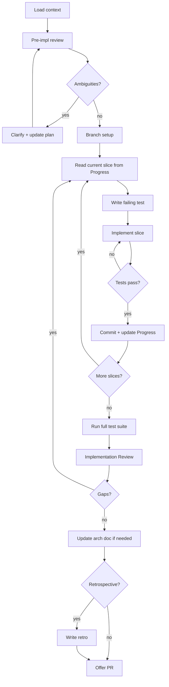

# Feature Implementation Workflow



## Context Budget

Read these files at STEP 1 (max 3):
1. `docs/features/FEAT-NNN-title.md` — the feature spec
2. `docs/plans/PLAN-NNN-title.md` — the implementation plan
3. `docs/arch/architecture.md`

---

## Steps

### STEP 1: Load Context

Find and read (use glob `docs/features/FEAT-NNN-*.md` and `docs/plans/PLAN-NNN-*.md`):
- Feature spec for the requested FEAT-NNN
- Implementation plan (same number: PLAN-NNN)
- Architecture doc

Check `## Progress` in the plan doc. If present, resume from the indicated slice — skip completed slices.

### STEP 2: Pre-Implementation Review

Read each vertical slice in the plan. For each one, verify:
- Is the scope clear? Could you write the test right now?
- Are the files to touch identified?
- Does the test description specify what to assert?

If any slice is ambiguous: ask the user to clarify. Update the plan doc with the clarification.
Do not start coding until every upcoming slice is unambiguous.

**Data-flow traceability check** — for every event or message the feature publishes:
1. List every field in the event's data class.
2. For each field, trace where it comes from at the moment of publishing: received in the triggering event, stored in a persistent entity, or derivable from local state.
3. If any field cannot be traced to an available source → the spec has a gap. Raise it with the user and update the spec before writing any code. Do not defer this to mid-implementation.

**Cross-section consistency check** — for every event defined in the spec:
- Verify the field list is identical in every place it appears (Data Model, Publisher table, Consumer table, sequence diagram).
- Any mismatch is a blocker. Resolve it with the user and update all sections before starting.

### STEP 3: Branch Setup

Check if branch `feat/FEAT-NNN-*` exists:
- If yes: `git checkout feat/FEAT-NNN-*`
- If no: `git checkout -b feat/FEAT-NNN-kebab-title` from main/master

### STEP 4: TDD Iteration Loop

Repeat for each uncompleted slice (in order):

#### 4a. Read Slice
Read the current slice from the plan. Note: files to touch, test description.

#### 4b. Write Failing Test
Write the test **before** any implementation code. The test must:
- Target exactly what the slice describes
- Be the minimum test that proves the slice behavior
- Follow existing test conventions and file structure in the project

> Before writing any test, check the **Testing Conventions** section in `docs/arch/architecture.md` for project-specific best practices.

**Run the test. It must FAIL.** If it passes immediately without implementation, the test does not verify the right thing — revise it.

#### 4c. Implement the Slice
Write the minimum code to make the test pass. Follow:
- Existing code patterns and naming conventions
- Architecture defined in `docs/arch/architecture.md`
- YAGNI — only what the test requires; no speculative code

> **Read before write:** before creating or modifying any configuration file, read the current version first. List all existing properties that must be preserved and confirm they appear in the new version before saving.

#### 4d. Run Tests
Run the full available test suite (or the affected module's tests if the full suite is slow). All tests must be green. If red:
- Fix the implementation (not the test, unless the test has a genuine error)
- Repeat 4c → 4d until green

#### 4e. Commit
```
feat(FEAT-NNN): implement [slice name] with tests
```

#### 4f. Update Progress
In `docs/plans/PLAN-NNN-*.md`, mark the slice's checkbox `[x]` and update `## Progress`:
- Current Slice: [next]
- Completed Slices: [add this one]
- Last Updated: [today]

Commit:
```
chore(FEAT-NNN): progress — slice [N] complete
```

### STEP 5: Full Test Suite

After all slices are complete, run the complete test suite. Every test must pass before proceeding.

### STEP 6: Implementation Review

> **This step also runs standalone** when user says "review implementation FEAT-NNN".
> Start here if triggered independently — load context (STEP 1) first.

Read:
1. `docs/features/FEAT-NNN-*.md` → Acceptance Criteria section
2. `docs/plans/PLAN-NNN-*.md` → all vertical slices

For **each acceptance criterion** in the spec:
- Find the test(s) that cover it
- Confirm the test(s) pass
- Mark ✅ or ❌

For **each vertical slice** in the plan:
- Confirm at least one test exists for it
- Confirm the test passes

Write results to `## Implementation Review` in the plan doc:

```markdown
## Implementation Review

Status: passed | failed
Reviewed: [date]

| Acceptance Criterion | Covering Test | Status |
|---|---|---|
| [criterion] | [test file:test name] | ✅ |

Gaps: [none / description]
```

**Important:** Do NOT recreate `PLAN-NNN` — update the existing file only. Fill in the Implementation Review table, set `Status: complete` in both the feature doc and plan doc, tick all `[ ]` goal and acceptance checkboxes, then remove the `## Progress` section.

Commit: `chore(FEAT-NNN): implementation review — [passed / N gaps found]`

**If gaps are found:** return to STEP 4 for the affected slices. Re-run the review after fixing.

### STEP 7: Update Architecture Doc

Remove the `## Progress` section from `docs/plans/PLAN-NNN-*.md` — implementation is complete.

If the implementation revealed differences from the spec's architecture (e.g., a component was split, a different pattern was used):
- Update `docs/arch/architecture.md` (Component Map or Data Model)
- Add an `## Implementation Notes` section to the feature spec noting the deviation

**ADR feedback loop** — for every deviation or decision recorded in `## Implementation Notes`, ask:
> "Does this represent an architectural constraint or convention that should apply to all future features?"

If yes:
1. Allocate ADR-NNN from `docs/registry.md` and write `docs/arch/adr/ADR-NNN-kebab-title.md`
2. Add a row to the `architecture.md` "Key Design Decisions" table linking to the ADR
3. Note in a comment in the ADR which workflow step future spec authors should read it at (e.g., "feature-spec.md STEP 6 — Consistency Check")

This closes the feedback loop: implementation decisions become ADRs, ADRs are reachable from the architecture doc, and the spec workflow reads the architecture doc before writing any new spec.

Commit any changes made in this step:
```
docs(FEAT-NNN): update architecture for implementation
```

### STEP 8: Opt-in Retrospective

Ask: "Would you like to add a retrospective for this implementation?"

If yes:
1. Allocate RETRO-NNN from registry
2. Copy `docs/templates/retrospective-template.md`
3. Write `docs/retrospectives/RETRO-NNN-impl-FEAT-NNN.md`
4. Commit: `chore(RETRO-NNN): feature impl retrospective for FEAT-NNN`

### STEP 9: Offer PR

Ask: "Ready to create a pull request for `feat/FEAT-NNN-*`?"

If yes: generate PR title (`feat(FEAT-NNN): [feature title]`) and body summarizing:
- What the feature does (from spec purpose)
- Acceptance criteria covered
- Tests added

Confirm the PR description with the user before creating.
