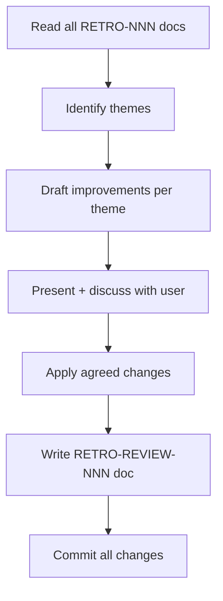

# Retrospective Review Workflow



## Context Budget

Files to read:
- All `docs/retrospectives/RETRO-NNN-*.md` files (use glob — do NOT read RETRO-REVIEW files)
- `AGENTS.md` (for potential updates)
- Any specific workflow or feature doc flagged for improvement

---

## Steps

### STEP 1: Read All Retrospectives

Use glob to list all files matching `docs/retrospectives/RETRO-[0-9]*.md`.

Read each one. For any `RETRO-REVIEW-NNN.md` files that exist, read them to determine which retrospectives have already been reviewed — focus analysis on the **unreviewed** ones, but note any recurring patterns from older ones too.

### STEP 2: Identify Themes

Group friction points and suggestions across all retrospectives by category:

| Category | Description |
|---|---|
| **Context Loading** | Too many files read, wrong files loaded, context overflows |
| **Spec Clarity** | Ambiguous requirements, missing edge cases, vague acceptance criteria |
| **Test Coverage** | Test gaps, unclear test descriptions, tests that don't catch real bugs |
| **Workflow Steps** | Steps that are confusing, missing, in the wrong order, or unnecessary |
| **Git Flow** | Branching, commit, or PR issues |
| **Documentation** | Docs too long, outdated, inconsistent, missing |
| **Other** | Anything not captured above |

For each category: list the RETRO IDs that mention it and count occurrences.

### STEP 3: Draft Improvements

For each category with **2 or more mentions**, draft 2–3 actionable improvements:
- Identify the specific friction from the retrospectives
- Propose a concrete change (edit a skill, add a step, remove a step, update a template, etc.)
- Reference the RETRO IDs as evidence

### STEP 4: Present and Discuss

Present the analysis to the user:

> "I reviewed [N] retrospectives. Here are the recurring themes:
>
> **[Category]** (mentioned N times: RETRO-001, RETRO-003)
> - [Description of friction]
> - Proposed fix: [specific change]
>
> [repeat for each theme]
>
> Which of these do you want to act on?"

Discuss each proposed change. Some may need adjustment. Agree on a prioritized list before making any changes.

### STEP 5: Apply Agreed Changes

For each agreed improvement, make the change:

| Target | Action |
|---|---|
| Workflow skill | Edit `.claude/skills/[workflow].md` |
| Reference doc | Edit `docs/workflows/[workflow].md` to match |
| AGENTS.md | Edit `AGENTS.md` |
| Feature spec | Edit `docs/features/FEAT-NNN-*.md` |
| Document template | Edit `docs/templates/[template].md` |

Commit each logical group of changes:
```
chore: [brief description of improvement] — retro review finding
```

### STEP 6: Write Review Doc

1. Allocate RETRO-REVIEW-NNN from `docs/registry.md`
2. Copy `docs/templates/retro-review-template.md` to `docs/retrospectives/RETRO-REVIEW-NNN.md`
3. Fill:
   - Retrospectives reviewed (list RETRO IDs)
   - Previously reviewed up to (highest RETRO-REVIEW NNN before this one, if any)
   - Themes found with examples and agreed actions
   - Changes made (list of files updated)
4. Commit: `chore(RETRO-REVIEW-NNN): retrospective review — [one-line theme summary]`
