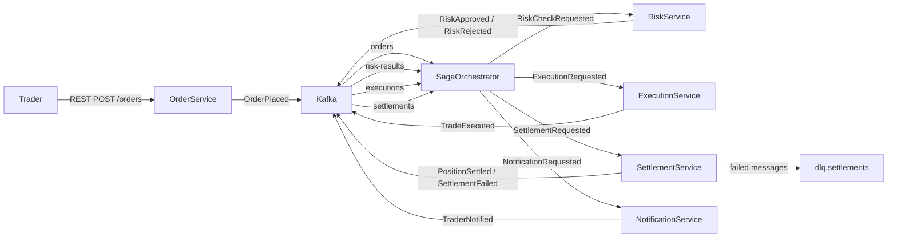

# Architecture — Trade Execution Platform

## System Overview



## Services

| Service | Role |
|---|---|
| `OrderService` | Accepts REST order submissions; publishes `OrderPlaced` event |
| `SagaOrchestrator` | Stateful orchestrator; drives saga steps; handles compensation |
| `RiskService` | External stub; validates order against risk limits; Resilience4j CB |
| `ExecutionService` | Simulates trade execution on exchange; publishes `TradeExecuted` |
| `SettlementService` | Updates positions; transactional Kafka producer; Resilience4j retry + bulkhead |
| `NotificationService` | Sends trader notification (log stub) |

## Kafka Topics

| Topic | Producer | Consumer | Notes |
|---|---|---|---|
| `orders` | OrderService | SagaOrchestrator | Order intake |
| `risk-results` | RiskService | SagaOrchestrator | Risk approve/reject |
| `executions` | ExecutionService | SagaOrchestrator, PositionService | Multiple consumer groups |
| `settlements` | SettlementService | SagaOrchestrator | Settlement outcomes |
| `notifications` | SagaOrchestrator | NotificationService | Trader alerts |
| `dlq.settlements` | Spring Kafka DLT | Manual review consumer | Poison-pill + retry exhaustion |

## Resilience4j Usage

| Component | Pattern | Purpose |
|---|---|---|
| RiskService client | Circuit Breaker | Open circuit when risk API error rate > threshold |
| SettlementService | Retry | Retry transient settlement failures (3 attempts, exponential backoff) |
| SettlementService | Bulkhead (ThreadPool) | Limit concurrent settlement calls |

## Data Model (stubs)

```kotlin
data class Order(val id: UUID, val traderId: String, val symbol: String, val quantity: Int, val side: Side)
data class Trade(val id: UUID, val orderId: UUID, val executedPrice: BigDecimal, val executedAt: Instant)
data class Position(val traderId: String, val symbol: String, val quantity: Int, val avgCost: BigDecimal)
enum class Side { BUY, SELL }
```

## Technology Decisions

| Decision | Choice | Reason |
|---|---|---|
| Build | Gradle Kotlin DSL | Idiomatic with Kotlin codebase |
| Messaging | Spring Kafka | Native Spring Boot integration |
| Resilience | Resilience4j | Lightweight, annotation-driven, Spring Boot starter |
| Serialization | JSON (Jackson) | Simple; swap for Avro/Protobuf in a future feature |
| Persistence | In-memory (HashMap) | Keeps focus on Kafka patterns; swap for PostgreSQL later |
| Infra | Docker Compose | Single-command local Kafka + Zookeeper |
