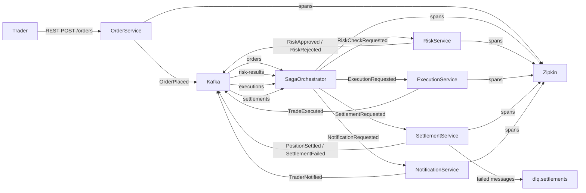
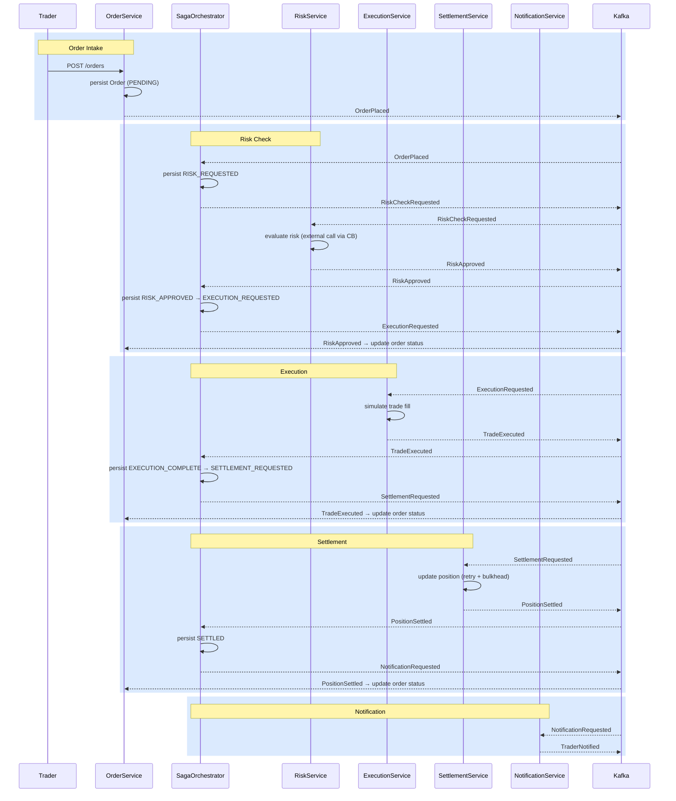
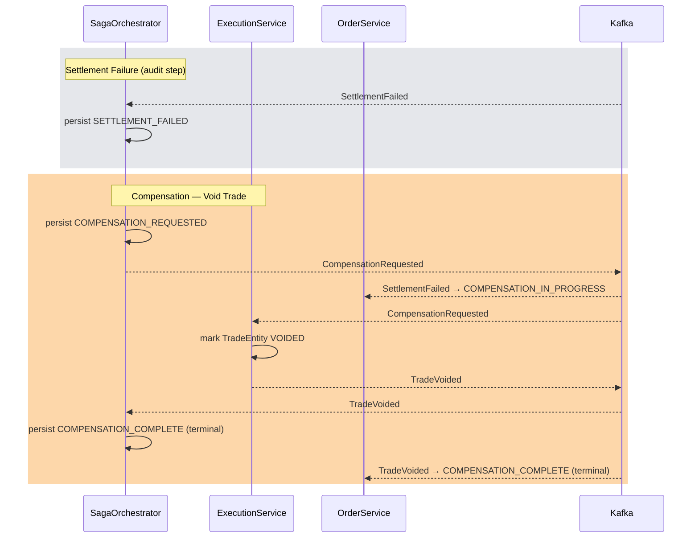

# Architecture — Trade Execution Platform

## System Overview



## Services

| Service | Role |
|---|---|
| `OrderService` | Accepts REST order submissions (port 8080); persists orders in H2 (Spring Data JPA); publishes `OrderPlaced` / `OrderCancelled`; consumes `RiskApproved`, `RiskRejected`, `TradeExecuted`, `PositionSettled`, `SettlementFailed` to update order status |
| `SagaOrchestrator` | Stateful orchestrator (port 8085); H2 + JPA saga state; drives saga steps; REST observability (`GET /sagas`); drives compensation on `SettlementFailed` |
| `RiskService` | Kafka consumer/producer (port 8081); consumes `RiskCheckRequested`; quantity-based approval rule; Resilience4j CB wrapping simulated external call |
| `ExecutionService` | Kafka consumer/producer (port 8082); simulates trade execution on exchange; publishes `TradeExecuted` |
| `SettlementService` | Kafka consumer/producer (port 8083); updates positions; transactional Kafka producer; Resilience4j retry + bulkhead |
| `NotificationService` | Kafka consumer/producer + WebSocket/STOMP push (port 8090); consumes `NotificationRequested`; broadcasts to `/topic/trader/{traderId}`; publishes `TraderNotified` to `trader-notifications` |
| `SystemTest` | E2E test module using Testcontainers with real Kafka for end-to-end verification of all use cases |

## Kafka Topics

| Topic | Producer | Consumer | Notes |
|---|---|---|---|
| `orders` | OrderService | SagaOrchestrator | Order intake (`OrderPlaced`, `OrderCancelled`) |
| `risk-checks` | SagaOrchestrator | RiskService | Risk evaluation requests (`RiskCheckRequested`) |
| `risk-results` | RiskService | SagaOrchestrator, OrderService | Risk approve/reject (`RiskApproved`, `RiskRejected`) |
| `execution-requests` | SagaOrchestrator | ExecutionService | Execution requests (`ExecutionRequested`) |
| `executions` | ExecutionService | SagaOrchestrator, OrderService, SettlementService | Trade fills (`TradeExecuted`) |
| `settlement-requests` | SagaOrchestrator | SettlementService | Settlement requests (`SettlementRequested`) |
| `settlements` | SettlementService | SagaOrchestrator, OrderService | Settlement outcomes (`PositionSettled`, `SettlementFailed`) |
| `notifications` | SagaOrchestrator | NotificationService | Trader alerts (`NotificationRequested`) |
| `trader-notifications` | NotificationService | — | Audit trail (`TraderNotified`) |
| `compensation-requests` | SagaOrchestrator | ExecutionService | Compensation trigger (`CompensationRequested`) |
| `compensation-results` | ExecutionService | SagaOrchestrator, OrderService | Compensation outcome (`TradeVoided`) |
| `dlq.settlements` | Spring Kafka DLT | Manual review consumer | Poison-pill + retry exhaustion |

## Resilience4j Usage

| Component | Pattern | Purpose |
|---|---|---|
| RiskService client | Circuit Breaker | Open circuit when risk API error rate > threshold |
| SettlementService | Retry | Retry transient settlement failures (3 attempts, exponential backoff) |
| SettlementService | Bulkhead (ThreadPool) | Limit concurrent settlement calls |

## Data Model

### Shared domain (`:shared`)

```kotlin
data class Order(val id: UUID, val traderId: String, val symbol: String, val quantity: Int, val side: Side)
data class Trade(val id: UUID, val orderId: UUID, val executedPrice: BigDecimal, val executedAt: Instant)
data class Position(val traderId: String, val symbol: String, val quantity: Int, val avgCost: BigDecimal)
enum class Side { BUY, SELL }
```

### Shared Kafka events (`:shared`)

| Event | Published by | Consumed by |
|---|---|---|
| `OrderPlaced(order)` | OrderService | SagaOrchestrator |
| `OrderCancelled(orderId)` | OrderService | SagaOrchestrator |
| `RiskCheckRequested(order)` | SagaOrchestrator | RiskService |
| `RiskApproved(orderId)` | RiskService | SagaOrchestrator, OrderService |
| `RiskRejected(orderId, reason)` | RiskService | SagaOrchestrator, OrderService |
| `ExecutionRequested(order)` | SagaOrchestrator | ExecutionService (future) |
| `TradeExecuted(trade)` | ExecutionService | SagaOrchestrator, OrderService, SettlementService |
| `SettlementRequested(trade, order)` | SagaOrchestrator | SettlementService |
| `PositionSettled(tradeId, position)` | SettlementService | SagaOrchestrator, OrderService |
| `SettlementFailed(tradeId, orderId, reason)` | SettlementService | SagaOrchestrator, OrderService |
| `CompensationRequested(orderId, tradeId, reason)` | SagaOrchestrator | ExecutionService |
| `TradeVoided(tradeId, orderId)` | ExecutionService | SagaOrchestrator, OrderService |
| `NotificationRequested(traderId, orderId, message)` | SagaOrchestrator | NotificationService |
| `TraderNotified(traderId, orderId, message)` | NotificationService | — |

## Gradle Module Layout

```
:shared            — Kotlin library (no Spring Boot): domain classes + Kafka event types
:order             — Spring Boot app: REST API (port 8080), Spring Data JPA (H2), Kafka producer + consumer
:risk              — Spring Boot app: Kafka consumer/producer
:execution         — Spring Boot app: Kafka consumer/producer
:settlement        — Spring Boot app: Kafka consumer/producer
:notification      — Spring Boot app: Kafka consumer/producer + WebSocket/STOMP push (port 8090)
:saga-orchestrator — Spring Boot app: Kafka consumer/producer (orchestrates saga)
:system-test       — Test module: E2E tests using Testcontainers (requires Docker)
```

Module dependency rule: all service modules depend on `:shared` only; no cross-service compile dependencies.

Version management:
- Spring BOM applied via `subprojects {}` in root `build.gradle.kts` — no Spring/Kafka versions in submodule files
- `gradle/libs.versions.toml` (Version Catalog) — Resilience4j and other non-BOM versions

## Local Infrastructure

| Component | Image | Port | Notes |
|---|---|---|---|
| Kafka | `apache/kafka:3.9` (KRaft) | 9092 | No Zookeeper needed |
| Zipkin | `openzipkin/zipkin:3` | 9411 | Distributed trace UI; added in FEAT-009 |

- `docker-compose.yml` — Kafka + Zipkin (daily dev; services run on JVM)
- `docker-compose.full.yml` — Kafka + Zipkin + all 6 services (demo/CI; each service built from `Dockerfile`)

### Docker Build Pattern

Service Dockerfiles use the **pre-built JAR pattern** (ADR-003): each Dockerfile expects a pre-built `*.jar` in `<service>/build/libs/` and only copies it into a JRE image. JAR files must be built on the host before `docker compose build` is invoked. Use `./gradlew systemTest` — this task declares `dependsOn` on all 6 `bootJar` tasks and enforces correct ordering automatically.

**Do not run `docker compose -f docker-compose.full.yml build` directly** without first building JARs — it will fail with a COPY error.

## Diagram Color Conventions

All sequence diagrams in this project use `rect` groupings to distinguish flow paths at a glance:

| Color | Meaning | Mermaid `rect` |
|---|---|---|
| Blue | Happy path — normal successful flow | `rect rgb(219, 234, 254)` |
| Orange | Compensation / rollback — triggered on failure | `rect rgb(253, 215, 170)` |
| Grey | Terminal failure — no recovery path | `rect rgb(229, 231, 235)` |

Apply this convention in all new sequence diagrams. Label each `rect` with a `Note` describing the phase.

## Key Flows

### Full Order Lifecycle (Happy Path)



### Settlement Failure — Compensation Path (FEAT-008)



## Key Design Decisions

| ID | Decision | Status |
|---|---|---|
| [ADR-001](adr/ADR-001-saga-state-as-recovery-anchor.md) | Saga state entity is the authoritative recovery anchor for future compensation logic | accepted |
| [ADR-002](adr/ADR-002-testcontainers-dockercompose-for-e2e-tests.md) | Testcontainers `DockerComposeContainer` wrapping `docker-compose.full.yml` for E2E system tests | accepted |
| [ADR-003](adr/ADR-003-pre-built-jar-dockerfile-pattern.md) | Service Dockerfiles copy pre-built JARs from host; no in-Docker Gradle builds | accepted |

## Testing Conventions

### Kafka Integration Tests — ObjectMapper

**Rule:** Always inject `@Autowired lateinit var objectMapper: ObjectMapper` in integration tests that deserialize Kafka messages. Never construct a standalone `ObjectMapper` manually.

**Why:** Spring Kafka's `JsonSerializer` does not register `JavaTimeModule` by default with Jackson 2.19.x. Events containing `java.time.Instant` fields (e.g. `Trade.executedAt`) serialize correctly via the Spring-managed `ObjectMapper` but fail silently when deserialized by a manually constructed one — producing a timeout rather than a clear error.

**Reference implementation:** `execution/src/main/kotlin/.../execution/KafkaConfig.kt` — custom `KafkaTemplate` bean with a properly configured `ObjectMapper`. Any module publishing events with `Instant` fields must follow this pattern.

### Spring Test Annotations — MockitoBean / MockitoSpyBean

**Rule:** Use `@MockitoBean` and `@MockitoSpyBean` from `org.springframework.test.context.bean.override.mockito` instead of `@MockBean`/`@SpyBean` from `org.springframework.boot.test.mock.mockito` (deprecated since Spring Boot 3.4).

**Why:** `@MockBean`/`@SpyBean` were moved to the Spring Framework test module in Spring Boot 3.4 and the Boot-specific variants deprecated. Using the replacement annotations keeps compilation warning-free and aligns with the upstream direction.

## Technology Decisions

| Decision | Choice | Reason |
|---|---|---|
| Build | Gradle Kotlin DSL | Idiomatic with Kotlin codebase |
| Module structure | Gradle multi-module, service-per-module | Compile-time boundaries mirror microservice topology |
| Version management | Spring BOM + Version Catalog | No version numbers scattered across submodule files |
| Messaging | Spring Kafka | Native Spring Boot integration |
| Resilience | Resilience4j | Lightweight, annotation-driven, Spring Boot starter |
| Serialization | JSON (Jackson) | Simple; swap for Avro/Protobuf in a future feature |
| Persistence | H2 in-memory (Spring Data JPA) | Structured, queryable order state for status tracking; swap for PostgreSQL in production |
| Infra | Docker Compose (KRaft) | Single-container Kafka, no Zookeeper dependency |
| Dev workflow | JVM services + Docker Kafka | Fast iteration; full Docker available via `docker-compose.full.yml` |
