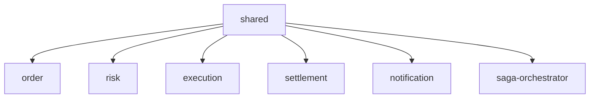

# FEAT-001: Create Gradle Multi-Module Structure

Status: in-progress
Date: 2026-03-12
Author: Claude

---

## Context & Motivation

The Spring Initializr starter is a single Gradle module (`trader`). The architecture calls for 6 independent services communicating exclusively via Kafka, plus a shared domain library. Splitting into Gradle submodules enforces compile-time boundaries between services, enables independent testing, and mirrors the microservice topology — making the learning goals around service isolation and Kafka communication tangible.

## Goals

- [ ] Restructure the project into 7 Gradle submodules (`:shared` + 6 service modules)
- [ ] Each service module is an independently runnable Spring Boot application
- [ ] `:shared` is a pure Kotlin library (no Spring Boot) holding domain + event types
- [ ] Dependency versions managed centrally in root `build.gradle.kts` (Spring BOM) and `gradle/libs.versions.toml` (Resilience4j)
- [ ] Kafka runs in Docker (KRaft mode); services run on JVM for daily development
- [ ] Both dev and full-Docker workflows documented in `README.md`

## Non-Goals

- Implementing any business logic (Kafka producers/consumers, sagas, circuit-breakers) — those are future features
- Service discovery, load balancing, or distributed tracing
- Cloud deployment or CI/CD pipeline setup

## Architecture

```
:shared            — Kotlin library: domain classes + Kafka event types
:order             — Spring Boot app: REST POST /orders → publishes OrderPlaced (port 8080)
:risk              — Spring Boot app: Kafka consumer/producer only (no HTTP)
:execution         — Spring Boot app: Kafka consumer/producer only
:settlement        — Spring Boot app: Kafka consumer/producer only
:notification      — Spring Boot app: Kafka consumer/producer only
:saga-orchestrator — Spring Boot app: Kafka consumer/producer only
```

### Dependency rules



- `:shared` has no module dependencies
- All service modules depend on `:shared` only; no cross-service compile dependencies
- Inter-service communication is exclusively via Kafka topics at runtime

### Version management

- Root `build.gradle.kts`: `subprojects {}` applies Spring Boot BOM to all modules
- `gradle/libs.versions.toml`: Version Catalog for non-BOM-managed dependencies (Resilience4j)
- Submodule `build.gradle.kts` files declare dependencies by name only, no versions

### Infrastructure

- `docker-compose.yml` — Kafka KRaft single container (port 9092), daily dev
- `docker-compose.full.yml` — Kafka + all 6 services, demo/CI
- Per-service `Dockerfile` — multi-stage build: Gradle → slim JRE image

## Data Model

Defined in `:shared`:

```kotlin
data class Order(val id: UUID, val traderId: String, val symbol: String, val quantity: Int, val side: Side)
data class Trade(val id: UUID, val orderId: UUID, val executedPrice: BigDecimal, val executedAt: Instant)
data class Position(val traderId: String, val symbol: String, val quantity: Int, val avgCost: BigDecimal)
enum class Side { BUY, SELL }
```

Kafka events (all in `:shared`): `OrderPlaced`, `RiskApproved`, `RiskRejected`, `TradeExecuted`, `PositionSettled`, `SettlementFailed`, `TraderNotified`

## API Surface / Interface

| Interface | Method/Type | Description |
|---|---|---|
| `POST /orders` | REST (`:order`) | Submit a new trade order; accepts Order JSON; returns order ID |

All other service interfaces are Kafka topics (defined in `docs/arch/architecture.md`).

## Edge Cases & Error Handling

| Scenario | Expected Behavior |
|---|---|
| Module build fails due to missing `:shared` class | Compile error surfaces immediately; fix in `:shared` first |
| Service starts without Kafka running | Spring Kafka auto-reconnect; log error, retry; service stays up |
| Port 8080 already in use | `:order` fails to start; configure `server.port` in `application.yml` |

## Acceptance Criteria

- [ ] `./gradlew projects` lists 7 submodules
- [ ] `./gradlew build` compiles all modules with zero errors
- [ ] `./gradlew :order:test` passes (contextLoads with embedded Kafka)
- [ ] `./gradlew :shared:build` compiles all domain + event classes
- [ ] `:shared` `build.gradle.kts` has no `spring-boot` plugin applied
- [ ] Root `src/` directory no longer exists
- [ ] `docker compose up -d` starts Kafka healthy on port 9092
- [ ] `README.md` covers both dev and full-Docker workflows

## Implementation Notes

> Agent: fill this section during feature-impl if implementation differs from spec.

## Related Docs

- [Architecture](../arch/architecture.md)
- [PLAN-001: Implementation Plan](../plans/PLAN-001-create-modules.md)
