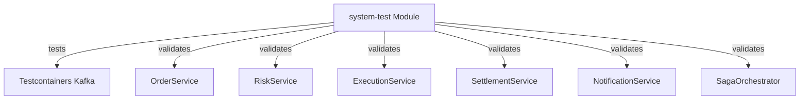
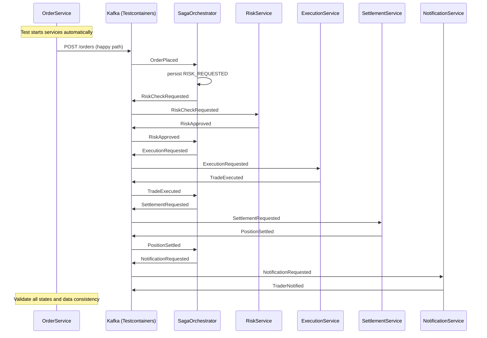

# FEAT-007: System Test Module — End-to-End E2E Tests with Testcontainers

Status: draft
Date: 2026-03-14
Author: Claude

## Progress

> Agent: update this section at each workflow step. Remove entire section when complete.

Current Step: 7
Completed Steps: [1, 2, 3, 4, 5, 6]
Last Updated: 2026-03-14
Notes: Initial design approved. Test infrastructure based on Testcontainers with Docker.

---

## Context & Motivation

The trade execution platform currently has individual module-level integration tests for each service, but no comprehensive end-to-end system test that verifies the full order lifecycle across all services. As features are added and bugs are fixed, there is no automated mechanism to ensure the entire system continues to work correctly.

This feature creates a dedicated `:system-test` module that provides:
- Comprehensive end-to-end testing of all use cases using Testcontainers
- Regression testing to catch regressions as the system evolves
- CI/CD integration via GitHub Actions
- Documentation for user and agent workflows

The system test module is **only meaningful with Docker** — without Docker, there are no meaningful tests to run (the Testcontainers setup would fail).

## Goals

- [ ] Create new Gradle module `:system-test` for E2E tests
- [ ] Implement Docker availability check at test startup
- [ ] Create 8 comprehensive test scenarios covering all use cases
- [ ] Integrate with GitHub Actions for CI/CD
- [ ] Provide user and agent documentation
- [ ] Make system tests part of `feature-impl` and `bugfix` verification workflows

## Non-Goals

- No Testcontainers for unit tests (embedded Kafka already exists in individual modules)
- No test mocking (tests use real Kafka and services)
- No additional services beyond Kafka (services start automatically via Testcontainers)
- No test data cleanup beyond Testcontainers container lifecycle
- No performance testing or load testing
- No test coverage report generation (existing coverage tools handle unit tests)

## Architecture

The `:system-test` module is a separate Gradle module with its own build configuration, completely isolated from production code. It uses Testcontainers to spin up a real Kafka container for each test class.



### Key Flows

The system test verifies the complete order lifecycle:



### Test Architecture

Each test class is independent:
- Uses `TestInstance.Lifecycle.PER_CLASS` for Testcontainers reuse
- Auto-starts Kafka container at class level
- Auto-stops Kafka container after all tests
- Thread-safe for parallel execution

## Data Model

No new data structures. The system test module validates existing data models and event types from the `:shared` module.

## API Surface / Interface

| Interface | Command | Description |
|---|---|---|
| Test execution | `./gradlew :system-test:test` | Run all E2E tests |
| Specific test | `./gradlew :system-test:test --tests "HappyPathSagaFlowTest"` | Run single test |
| CI run | GitHub Action workflow | Automatic on PR/merge |

## Edge Cases & Error Handling

| Scenario | Expected Behavior |
|---|---|
| Docker not installed | Test suite aborts with clear error message |
| Docker daemon unresponsive | Test suite aborts with clear error message |
| Docker available but slow to start | Tests use `@BeforeAll` with proper waiting; test execution may take longer |
| Test fails | Detailed error message with Kafka topic contents and service logs |
| Concurrent tests | Each test uses unique Kafka topics; no test interference |

## Configuration

### `system-test/build.gradle.kts`

```kotlin
plugins {
    kotlin("jvm")
    kotlin("plugin.spring")
    id("org.springframework.boot")
    id("io.spring.dependency-management")
}

java {
    toolchain {
        languageVersion = JavaLanguageVersion.of(17)
    }
}

kotlin {
    compilerOptions {
        freeCompilerArgs.addAll("-Xjsr305=strict")
    }
}

dependencyManagement {
    imports {
        mavenBom("org.springframework.boot:spring-boot-dependencies:${property("springBootVersion")}")
    }
}

dependencies {
    implementation(project(":shared"))

    testImplementation("org.springframework.boot:spring-boot-starter-test")
    testImplementation("org.jetbrains.kotlin:kotlin-test-junit5")
    testImplementation("org.springframework.kafka:spring-kafka-test")
    testImplementation("org.awaitility:awaitility-kotlin:4.2.1")
    testImplementation("org.testcontainers:testcontainers:1.20.0")
    testImplementation("org.testcontainers:kafka:1.20.0")

    testRuntimeOnly("org.junit.platform:junit-platform-launcher")
}

tasks.test {
    useJUnitPlatform()
    systemProperty("junit.jupiter.execution.parallel.enabled", "true")
    systemProperty("junit.jupiter.execution.parallel.config.strategy", "fixed")
    systemProperty("junit.jupiter.execution.parallel.config.fixed.parallelism", "4")
}
```

### `src/test/resources/application.yml`

```yaml
spring:
  kafka:
    bootstrap-servers: localhost:9999
    listener:
      auto-startup: false
```

## Acceptance Criteria

- [ ] `./gradlew :system-test:build` — module compiles
- [ ] `./gradlew :system-test:test` — all tests run and pass (with Docker)
- [ ] Docker check at test startup with clear error message when Docker not available
- [ ] All 8 test scenarios implemented and passing
- [ ] GitHub Action workflow configured
- [ ] User documentation created at `docs/system-test-guide.md`
- [ ] System tests run as part of `feature-impl` workflow verification
- [ ] System tests run as part of `bugfix` workflow verification

## Implementation Notes

> Agent: fill this section during feature-impl if implementation differs from spec.

## Related Docs

- [FEAT-002: Order Service](FEAT-002-order-service.md)
- [FEAT-003: Risk Service](FEAT-003-risk-service.md)
- [FEAT-004: Saga Orchestrator](FEAT-004-saga-orchestrator.md)
- [FEAT-005: Execution Service](FEAT-005-execution-service.md)
- [FEAT-006: Settlement Service](FEAT-006-settlement-service.md)
- [Architecture](../arch/architecture.md)
- [PLAN-007: Implementation Plan](../plans/PLAN-007-system-test.md)