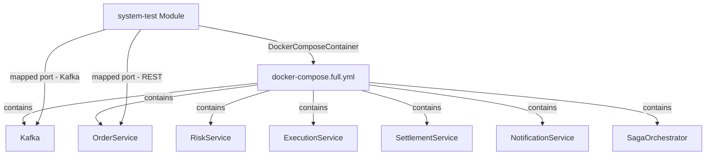
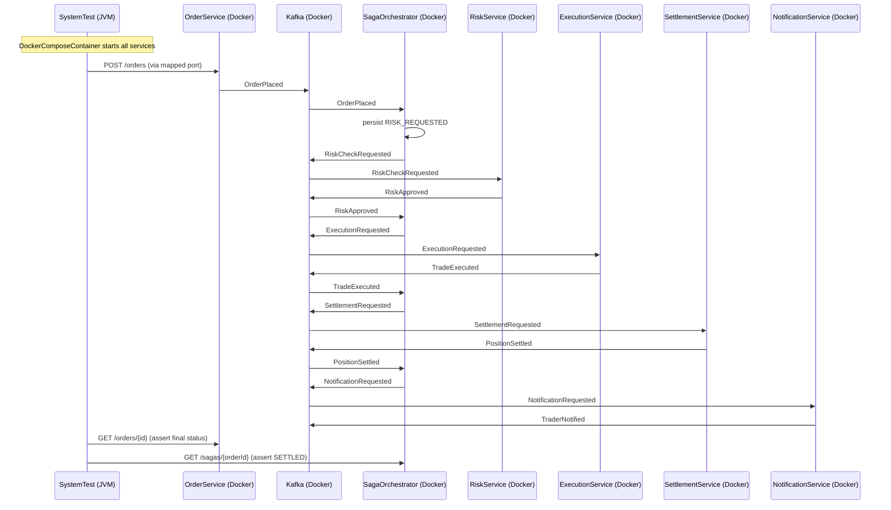

# FEAT-007: System Test Module — End-to-End E2E Tests with Testcontainers

Status: complete
Date: 2026-03-14
Author: Claude

---

## Context & Motivation

The trade execution platform currently has individual module-level integration tests for each service, but no comprehensive end-to-end system test that verifies the full order lifecycle across all services. As features are added and bugs are fixed, there is no automated mechanism to ensure the entire system continues to work correctly.

This feature creates a dedicated `:system-test` module that provides:
- Comprehensive end-to-end testing of all use cases using Testcontainers
- Regression testing to catch regressions as the system evolves
- CI/CD integration via GitHub Actions
- Documentation for user and agent workflows

The system test module is **only meaningful with Docker** — without Docker, there are no meaningful tests to run (the Testcontainers setup would fail).

## Goals

- [x] Create new Gradle module `:system-test` for E2E tests
- [x] Implement Docker availability check at test startup
- [x] Create 8 comprehensive test scenarios covering all use cases
- [x] Integrate with GitHub Actions for CI/CD
- [x] Provide user and agent documentation
- [x] Make system tests part of `feature-impl` and `bugfix` verification workflows

## Non-Goals

- No Testcontainers for unit tests (embedded Kafka already exists in individual modules)
- No test mocking (tests use real Kafka and services)
- All services (including Kafka) start via `DockerComposeContainer` wrapping `docker-compose.full.yml`; no in-process service startup
- No test data cleanup beyond Testcontainers container lifecycle
- No performance testing or load testing
- No test coverage report generation (existing coverage tools handle unit tests)

## Architecture

The `:system-test` module is a separate Gradle module with its own build configuration, completely isolated from production code. It uses Testcontainers `DockerComposeContainer` to start the full service stack (all 6 services + Kafka) via the existing `docker-compose.full.yml`.

**How it works:**
- All services run as Docker containers within the compose network and connect to Kafka via the internal service name (`kafka:9092`) — no special configuration needed
- Test code (JVM, outside Docker) accesses services via Testcontainers-mapped ports:
  - Kafka mapped port → used by `KafkaTestUtils` to produce/consume test messages
  - `order-service:8080` mapped port → used for REST calls (`POST /orders`, `POST /orders/{id}/cancel`, `GET /orders/{id}`)
- The test's own Spring context has `spring.kafka.bootstrap-servers` overridden via `@DynamicPropertySource` with the container's actual mapped port

**Module dependency:** `:system-test` only depends on `:shared` (for event types). No compile dependency on any service module — all services run externally as Docker containers.

**Test speed:** `DockerComposeContainer` runs `docker-compose build` before first startup (building all service images from their Dockerfiles). Subsequent runs use Docker layer cache. CI cold-start is slow by design; this is the expected trade-off for true end-to-end isolation.



### Key Flows

The system test verifies the complete order lifecycle:



### Test Architecture

Each test class is independent:
- Uses `TestInstance.Lifecycle.PER_CLASS` — one `DockerComposeContainer` per test class, started in `@BeforeAll`, stopped in `@AfterAll`
- Test *methods* within a class run sequentially, sharing the same compose stack; each method uses unique order IDs to avoid state collision
- Test *classes* run in parallel (parallelism=4 in JUnit config) — each class gets its own isolated stack
- Thread-safe: no shared mutable state between test classes

## Data Model

No new data structures. The system test module validates existing data models and event types from the `:shared` module.

## API Surface / Interface

| Interface | Command | Description |
|---|---|---|
| Test execution | `./gradlew :system-test:test` | Run all E2E tests |
| Specific test | `./gradlew :system-test:test --tests "HappyPathSagaFlowTest"` | Run single test |
| CI run | GitHub Action workflow | Automatic on PR/merge |

## Edge Cases & Error Handling

| Scenario | Expected Behavior |
|---|---|
| Docker not installed | Test suite aborts with clear error message |
| Docker daemon unresponsive | Test suite aborts with clear error message |
| Docker available but slow to start | Tests use `@BeforeAll` with proper waiting; test execution may take longer |
| Test fails | Detailed error message with Kafka topic contents and service logs |
| Concurrent tests | Each test uses unique Kafka topics; no test interference |

## Configuration

### `system-test/build.gradle.kts`

```kotlin
plugins {
    kotlin("jvm")
    kotlin("plugin.spring")
    id("org.springframework.boot")
    id("io.spring.dependency-management")
}

java {
    toolchain {
        languageVersion = JavaLanguageVersion.of(17)
    }
}

kotlin {
    compilerOptions {
        freeCompilerArgs.addAll("-Xjsr305=strict")
    }
}

dependencyManagement {
    imports {
        mavenBom("org.springframework.boot:spring-boot-dependencies:${property("springBootVersion")}")
    }
}

dependencies {
    implementation(project(":shared"))

    testImplementation("org.springframework.boot:spring-boot-starter-test")
    testImplementation("org.jetbrains.kotlin:kotlin-test-junit5")
    testImplementation("org.springframework.kafka:spring-kafka-test")  // KafkaTestUtils for producing/consuming in tests
    testImplementation("org.awaitility:awaitility-kotlin")              // version managed by Spring Boot BOM
    testImplementation("org.testcontainers:testcontainers")             // version managed by Spring Boot BOM; includes DockerComposeContainer

    testRuntimeOnly("org.junit.platform:junit-platform-launcher")
}

tasks.test {
    useJUnitPlatform()
    systemProperty("junit.jupiter.execution.parallel.enabled", "true")
    systemProperty("junit.jupiter.execution.parallel.config.strategy", "fixed")
    systemProperty("junit.jupiter.execution.parallel.config.fixed.parallelism", "4")
}
```

### `src/test/resources/application.yml`

```yaml
spring:
  kafka:
    bootstrap-servers: localhost:9999  # placeholder; overridden at runtime
    listener:
      auto-startup: false
```

The placeholder `localhost:9999` is overridden in `SystemTestBase` via `@DynamicPropertySource` once the `DockerComposeContainer` is running:

```kotlin
companion object {
    @JvmStatic
    @DynamicPropertySource
    fun kafkaProperties(registry: DynamicPropertyRegistry) {
        registry.add("spring.kafka.bootstrap-servers") {
            composeContainer.getServiceHost("kafka", 9092) + ":" +
            composeContainer.getServicePort("kafka", 9092)
        }
    }
}
```

## Acceptance Criteria

- [x] `./gradlew :system-test:build` — module compiles
- [x] `./gradlew :system-test:test` — all tests run and pass (with Docker)
- [x] Docker check at test startup with clear error message when Docker not available
- [x] All 6 services start via `DockerComposeContainer` and the happy path test completes end-to-end
- [x] All 8 test scenarios implemented and passing
- [x] GitHub Action workflow configured
- [x] User documentation created at `docs/system-test-guide.md`
- [x] System tests run as part of `feature-impl` workflow verification
- [x] System tests run as part of `bugfix` workflow verification

## Implementation Notes

**Fixed ports instead of `withExposedService()` mapped ports**
The spec described using `withExposedService()` to get dynamically mapped ports for Kafka and services, with `@DynamicPropertySource` to inject the Kafka bootstrap address. In practice, `withExposedService()` is incompatible with Docker Compose V2: it triggers Testcontainers' socat ambassador proxy which uses Docker Compose V1 container naming (`project_service_1` with underscores), while Docker Compose V2 uses dashes (`project-service-1`), causing a `ContainerLaunchException`. The implementation uses fixed localhost ports instead: order-service on 8080, saga-orchestrator on 8085, Kafka on 9092 (as mapped in `docker-compose.full.yml`). No `@DynamicPropertySource` is needed since test classes have no Spring context.

**Shared compose stack (singleton companion object)**
The spec described one `DockerComposeContainer` per test class (started/stopped in `@BeforeAll`/`@AfterAll`). The implementation uses a Kotlin companion object singleton in `SystemTestBase`, so all test classes share one compose stack per JVM process. This avoids port conflicts and speeds up the full test suite significantly. Test isolation is achieved via unique order IDs.

**No Spring context in test classes**
Test classes are plain JUnit 5 with `RestTemplate` for HTTP and Kafka producers/consumers configured directly. No `@SpringBootTest` is used.

**Kafka consumer group readiness check**
`SystemTestBase.awaitKafkaConsumerGroupsReady()` was added to poll the Kafka `AdminClient` until `settlement-service`, `saga-orchestrator`, and `order-service` consumer groups reach `STABLE` state before any test runs. This prevents flaky failures caused by slow Kafka consumer startup (particularly settlement-service, which has no HTTP endpoint to poll for readiness).

## Related Docs

- [FEAT-002: Order Service](FEAT-002-order-service.md)
- [FEAT-003: Risk Service](FEAT-003-risk-service.md)
- [FEAT-004: Saga Orchestrator](FEAT-004-saga-orchestrator.md)
- [FEAT-005: Execution Service](FEAT-005-execution-service.md)
- [FEAT-006: Settlement Service](FEAT-006-settlement-service.md)
- [Architecture](../arch/architecture.md)
- [PLAN-007: Implementation Plan](../plans/PLAN-007-system-test.md)