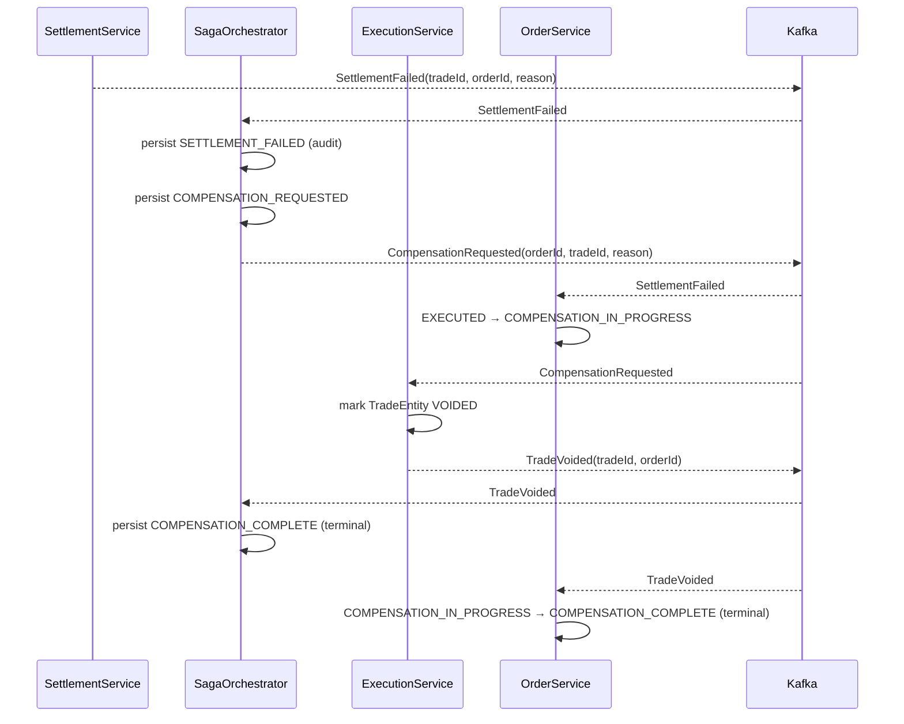

# FEAT-008: Saga Compensation — Rollback on Settlement Failure

Status: complete
Date: 2026-03-16
Author: Claude

## Progress

Current Step: 9
Completed Steps: [1, 2, 3, 4, 5, 6, 7, 8]
Last Updated: 2026-03-16
Notes: Spec finalised after codebase exploration. Key decisions: COMPENSATION_IN_PROGRESS
  OrderStatus (not EXECUTION_FAILED), SETTLEMENT_FAILED saved as audit step before
  COMPENSATION_REQUESTED, SETTLEMENT_FAILED removed from isTerminal. Cancel-in-flight
  deferred to FEAT-011.

---

## Context & Motivation

FEAT-004 deferred compensation logic with an explicit non-goal. ADR-001 designated the
`SagaStateEntity` as the authoritative recovery anchor for future compensation. Currently,
`SETTLEMENT_FAILED` is a terminal saga step that leaves the system in an inconsistent state:
a trade was executed (ExecutionService captured a price and published `TradeExecuted`), but
the position was never updated. No mechanism exists to undo that executed trade.

This feature implements the compensating-transaction arm of the saga pattern. When the
`SettlementService` exhausts all retries and publishes `SettlementFailed`, the
`SagaOrchestrator` now drives a rollback: it voids the executed trade in the
`ExecutionService` and returns the order to a clean terminal state.

After this feature, every saga either reaches `SETTLED` (happy path) or
`COMPENSATION_COMPLETE` (clean failure path). No saga is left with an orphaned executed
trade.

**Scope boundary:** This feature covers system-triggered compensation on settlement failure
only. User-initiated cancellation of in-flight orders is deferred to FEAT-011.

## Goals

- [x] Add `TradeEntity` to `:execution` module — persist each executed trade with status
      `EXECUTED` or `VOIDED` (H2 + Spring Data JPA); modify `ExecutionService.execute()`
      to persist on every `TradeExecuted` event
- [x]Add new shared events to `:shared`:
      `CompensationRequested(orderId, tradeId, reason)` and `TradeVoided(tradeId, orderId)`
- [x]New Kafka topics:
      - `compensation-requests` (SagaOrchestrator → ExecutionService)
      - `compensation-results` (ExecutionService → SagaOrchestrator, OrderService)
- [x]`SagaOrchestrator.onSettlementFailed`: change from terminal to compensation trigger —
      save `SETTLEMENT_FAILED` (audit step), then save `COMPENSATION_REQUESTED`, then
      publish `CompensationRequested(orderId, tradeId, reason)`
- [x]New `SagaOrchestrator.onTradeVoided`: consume `TradeVoided` from
      `compensation-results`; guard (must be `COMPENSATION_REQUESTED`); save
      `COMPENSATION_COMPLETE` (terminal)
- [x]New `SagaEventPublisher.publishCompensationRequested(orderId, tradeId, reason)`
      → topic `compensation-requests`
- [x]New `ExecutionService` compensation path — `CompensationKafkaListener` consumes
      `CompensationRequested`; `ExecutionCompensationService.voidTrade()` marks
      `TradeEntity.status = VOIDED`; publishes `TradeVoided` → `compensation-results`
- [x]`OrderEventListener.onSettlement` — change `SettlementFailed` handler: transition
      `EXECUTED → COMPENSATION_IN_PROGRESS` (instead of current `EXECUTION_FAILED`)
- [x]New `OrderEventListener.onCompensationResult` — consume `TradeVoided` from
      `compensation-results`; transition `COMPENSATION_IN_PROGRESS → COMPENSATION_COMPLETE`
- [x]Add `COMPENSATION_IN_PROGRESS`, `COMPENSATION_COMPLETE` to `OrderStatus`;
      `COMPENSATION_IN_PROGRESS` is non-terminal, `COMPENSATION_COMPLETE` is terminal
- [x]Update `SagaStep.isTerminal` — remove `SETTLEMENT_FAILED`; add `COMPENSATION_COMPLETE`
      and `COMPENSATION_FAILED`; new set: `{RISK_REJECTED, SETTLED, COMPENSATION_COMPLETE,
      COMPENSATION_FAILED}`
- [x]Add `COMPENSATION_REQUESTED`, `COMPENSATION_COMPLETE`, `COMPENSATION_FAILED` to
      `SagaStep` enum
- [x]Integration tests: compensation path in `:saga-orchestrator` and `:execution`
- [x]System-test: `SagaCompensationTest` — `settlement.simulate-failure-probability=1.0`,
      verify saga reaches `COMPENSATION_COMPLETE` and order reaches `COMPENSATION_COMPLETE`

## Non-Goals

- No compensation for `RISK_REJECTED` (no trade was executed; no rollback needed)
- No compensation for execution failure (ExecutionService failure handling deferred)
- No undo of RiskService approval (stateless/idempotent check)
- No user-initiated cancellation of in-flight orders (deferred to FEAT-011)
- No compensation retry (if `TradeVoided` is never received, saga stays in
  `COMPENSATION_REQUESTED` indefinitely; timeout/alerting deferred)
- No distributed sagas or two-phase commit
- No authentication or authorisation

## Architecture

### Revised Saga State Machine

```
[OrderPlaced]         ──▶ RISK_REQUESTED
[RiskApproved]        ──▶ RISK_APPROVED ──▶ EXECUTION_REQUESTED
[RiskRejected]        ──▶ RISK_REJECTED                    (terminal)
[TradeExecuted]       ──▶ EXECUTION_COMPLETE ──▶ SETTLEMENT_REQUESTED
[PositionSettled]     ──▶ SETTLED ──▶ (NotificationRequested)  (terminal)
[SettlementFailed]    ──▶ SETTLEMENT_FAILED ──▶ COMPENSATION_REQUESTED  ← changed
[TradeVoided]         ──▶ COMPENSATION_COMPLETE            (terminal)
[—]                         COMPENSATION_FAILED            (terminal — reserved)
```

Terminal states (after FEAT-008): `RISK_REJECTED`, `SETTLED`, `COMPENSATION_COMPLETE`,
`COMPENSATION_FAILED`.

`SETTLEMENT_FAILED` is no longer terminal — it is an audit-trail step that transitions
immediately to `COMPENSATION_REQUESTED` within the same transaction.

### Race Condition: Concurrent SettlementFailed + Duplicate Events

The existing guard mechanisms already handle duplicate and out-of-order events:

```
Duplicate SettlementFailed arrives after saga is COMPENSATION_REQUESTED:
  SagaOrchestrator.onSettlementFailed()
    entity.step = COMPENSATION_REQUESTED (not SETTLEMENT_REQUESTED)
    → guard: "expected SETTLEMENT_REQUESTED, got COMPENSATION_REQUESTED" → skip ✓

TradeVoided arrives after saga is COMPENSATION_COMPLETE:
  isTerminalOrWarn() → true (COMPENSATION_COMPLETE is terminal) → skip ✓
```

### Component Layout

ExecutionService additions:
```
execution-requests topic
        │  (ExecutionRequested — existing)
        ▼
ExecutionKafkaListener.onExecutionRequested()
        │
        ▼
ExecutionService.execute(order)          ← modified: now also persists TradeEntity
        │
        ├── TradeRepository.save(TradeEntity(status=EXECUTED))
        └── ExecutionEventPublisher.publishTradeExecuted(trade)

compensation-requests topic              ← new
        │  (CompensationRequested)
        ▼
CompensationKafkaListener.onCompensationRequested()
        │
        ▼
ExecutionCompensationService.voidTrade(tradeId, orderId)
        │
        ├── TradeRepository.findById(tradeId)
        │     if found: mark VOIDED
        │     if not found: log WARN (publish TradeVoided anyway — saga must advance)
        └── ExecutionEventPublisher.publishTradeVoided(tradeId, orderId)
                → compensation-results topic
```

SagaOrchestrator additions:
```
settlements topic — existing listener, modified:
        │  (SettlementFailed)
        ▼
SagaOrchestrator.onSettlementFailed()
        │  guard: entity.step must be SETTLEMENT_REQUESTED
        ├── save(SETTLEMENT_FAILED)    ← audit step
        ├── save(COMPENSATION_REQUESTED)
        └── publisher.publishCompensationRequested(orderId, tradeId, reason)

compensation-results topic             ← new listener
        │  (TradeVoided)
        ▼
SagaOrchestrator.onTradeVoided()
        │  guard: entity.step must be COMPENSATION_REQUESTED
        └── save(COMPENSATION_COMPLETE)
```

### Kafka

**New topics:**

| Topic | Producer | Consumer |
|---|---|---|
| `compensation-requests` | SagaOrchestrator | ExecutionService |
| `compensation-results`  | ExecutionService | SagaOrchestrator, OrderService |

**New events:**

| Topic | Event | Producer | Consumer |
|---|---|---|---|
| `compensation-requests` | `CompensationRequested(orderId, tradeId, reason)` | SagaOrchestrator | ExecutionService |
| `compensation-results`  | `TradeVoided(tradeId, orderId)`                  | ExecutionService | SagaOrchestrator, OrderService |

### Key Flow



### ADR-001 Constraint

Per ADR-001, all state transitions are persisted before publishing downstream Kafka messages.
`onSettlementFailed` saves both `SETTLEMENT_FAILED` and `COMPENSATION_REQUESTED` to the DB
before calling `publisher.publishCompensationRequested(...)`. This is enforced via
`@Transactional`.

If the JVM crashes after the DB commit but before the Kafka send, `CompensationRequested`
will not be published. The saga state remains in `COMPENSATION_REQUESTED`. Manual or
operator-triggered reprocessing is required to advance it — consistent with ADR-001's
acknowledged trade-off.

## Data Model

### New events in `:shared`

```kotlin
data class CompensationRequested(val orderId: UUID, val tradeId: UUID, val reason: String)
data class TradeVoided(val tradeId: UUID, val orderId: UUID)
```

### `TradeEntity` in `:execution` (new)

| Field | Type | Notes |
|---|---|---|
| `id` | UUID | PK — same UUID as `Trade.id` |
| `orderId` | UUID | FK-like reference |
| `executedPrice` | BigDecimal | Captured at execution time |
| `executedAt` | Instant | Execution timestamp |
| `status` | String | `TradeStatus` enum name: `EXECUTED` or `VOIDED` |

```kotlin
enum class TradeStatus { EXECUTED, VOIDED }

@Entity
@Table(name = "trades")
data class TradeEntity(
    @Id val id: UUID,
    @Column(nullable = false) val orderId: UUID,
    @Column(nullable = false) val executedPrice: BigDecimal,
    @Column(nullable = false) val executedAt: Instant,
    @Column(nullable = false) var status: String = TradeStatus.EXECUTED.name
)
```

### `SagaStep` enum (updated)

```kotlin
enum class SagaStep {
    RISK_REQUESTED,
    RISK_APPROVED, RISK_REJECTED,
    EXECUTION_REQUESTED, EXECUTION_COMPLETE,
    SETTLEMENT_REQUESTED,
    SETTLED,
    SETTLEMENT_FAILED,        // audit step — transitions immediately to COMPENSATION_REQUESTED
    COMPENSATION_REQUESTED,   // new
    COMPENSATION_COMPLETE,    // new (terminal)
    COMPENSATION_FAILED,      // new (terminal — reserved for future)
    NOTIFICATION_SENT;        // reserved — not yet activated

    val isTerminal: Boolean get() = this in setOf(
        RISK_REJECTED, SETTLED, COMPENSATION_COMPLETE, COMPENSATION_FAILED
    )
    // Note: SETTLEMENT_FAILED removed from isTerminal — it is now a transitional audit step
}
```

### `OrderStatus` enum (updated)

```kotlin
enum class OrderStatus {
    PENDING, RISK_APPROVED, RISK_REJECTED,
    EXECUTED,
    SETTLED, EXECUTION_FAILED,
    CANCELLED,
    COMPENSATION_IN_PROGRESS,  // new — non-terminal; set when SettlementFailed
    COMPENSATION_COMPLETE;     // new — terminal; set when TradeVoided

    val isTerminal: Boolean
        get() = when (this) {
            RISK_REJECTED, SETTLED, EXECUTION_FAILED, CANCELLED, COMPENSATION_COMPLETE -> true
            else -> false
        }
}
```

`EXECUTION_FAILED` is retained in the enum as a terminal fallback but is no longer set
by `SettlementFailed` handling after FEAT-008.

## API Surface / Interface

| Interface | Type | Description |
|---|---|---|
| `compensation-requests` topic | Kafka producer (SagaOrchestrator) | Publishes `CompensationRequested` on `SettlementFailed` |
| `compensation-requests` topic | Kafka consumer (ExecutionService, group-id `execution-service`) | Consumes `CompensationRequested` |
| `compensation-results` topic  | Kafka producer (ExecutionService) | Publishes `TradeVoided` |
| `compensation-results` topic  | Kafka consumer (SagaOrchestrator, group-id `saga-orchestrator`) | Consumes `TradeVoided` |
| `compensation-results` topic  | Kafka consumer (OrderService, group-id `order-service`) | Consumes `TradeVoided` |
| `GET /sagas/{orderId}` | REST (existing) | Returns `SETTLEMENT_FAILED` → `COMPENSATION_REQUESTED` → `COMPENSATION_COMPLETE` during flow |

## Edge Cases & Error Handling

| Scenario | Expected Behavior |
|---|---|
| `SettlementFailed` arrives but saga is not in `SETTLEMENT_REQUESTED` (e.g., duplicate) | Log WARN "expected SETTLEMENT_REQUESTED, got …", skip |
| `CompensationRequested` for already-`VOIDED` trade | Mark VOIDED (idempotent); publish `TradeVoided` again |
| `CompensationRequested` for unknown `tradeId` | Log WARN; publish `TradeVoided` anyway (saga must advance) |
| `TradeVoided` arrives for saga not in `COMPENSATION_REQUESTED` | `isTerminalOrWarn` returns true → log WARN, skip |
| JVM crash after DB commit but before `CompensationRequested` published | Saga stuck in `COMPENSATION_REQUESTED`; requires manual replay (ADR-001 acknowledged trade-off) |
| `entity.tradeId` is null when `SettlementFailed` arrives | Should not happen (populated by `onTradeExecuted`); if null, log ERROR and skip — do not publish compensation |
| `OrderService` receives `TradeVoided` but order is not `COMPENSATION_IN_PROGRESS` | `applyTransition` logs WARN "unexpected fromStatus", skips |

## Configuration

### `:execution` `build.gradle.kts` additions

```kotlin
implementation("org.springframework.boot:spring-boot-starter-data-jpa")
runtimeOnly("com.h2database:h2")
```

### `:execution` `src/main/resources/application.yml` additions

```yaml
spring:
  datasource:
    url: jdbc:h2:mem:executiondb;DB_CLOSE_DELAY=-1
    driver-class-name: org.h2.Driver
  jpa:
    hibernate:
      ddl-auto: create-drop
    show-sql: false
  main:
    web-application-type: none   # already present — no change
```

### `:execution` `src/test/resources/application.yml` (new file)

```yaml
spring:
  datasource:
    url: jdbc:h2:mem:executiondb;DB_CLOSE_DELAY=-1
    driver-class-name: org.h2.Driver
  jpa:
    hibernate:
      ddl-auto: create-drop
  kafka:
    bootstrap-servers: localhost:9999
    consumer:
      group-id: execution-service
      value-deserializer: org.springframework.kafka.support.serializer.ErrorHandlingDeserializer
      properties:
        spring.deserializer.value.delegate.class: org.springframework.kafka.support.serializer.JsonDeserializer
        spring.json.trusted.packages: "de.antrophos.demo.spring.kafka.trader.shared.events,de.antrophos.demo.spring.kafka.trader.shared.domain"
        spring.json.use.type.headers: true
    listener:
      auto-startup: false
```

### `:order` `src/main/resources/application.yml` addition

```yaml
# Add compensation-results to the consumer topics for order-service group
# (handled via new @KafkaListener annotation — no yml change needed)
```

### `:saga-orchestrator` `src/main/resources/application.yml` addition

```yaml
# compensation-results added via new @KafkaListener annotation — no yml change needed
```

## Acceptance Criteria

- [x]`./gradlew :shared:build` — `CompensationRequested` and `TradeVoided` compile
- [x]`./gradlew :execution:test` — `TradeEntity` persisted on each `TradeExecuted`;
      `VOIDED` on `CompensationRequested`; `TradeVoided` published
- [x]`./gradlew :saga-orchestrator:test` — `SettlementFailed` → saves `SETTLEMENT_FAILED`
      then `COMPENSATION_REQUESTED`; `CompensationRequested` published; `TradeVoided` →
      saves `COMPENSATION_COMPLETE`
- [x]`./gradlew :order:test` — `SettlementFailed` → order `COMPENSATION_IN_PROGRESS`;
      `TradeVoided` → order `COMPENSATION_COMPLETE`
- [x]`./gradlew build` — all modules compile and all existing tests pass
- [x]System test: `SagaCompensationTest` — `settlement.simulate-failure-probability=1.0`
      → saga reaches `COMPENSATION_COMPLETE`, order reaches `COMPENSATION_COMPLETE`
- [x]Idempotency: duplicate `SettlementFailed` after saga is `COMPENSATION_REQUESTED`
      → skipped (not double-compensated)
- [x]Idempotency: duplicate `CompensationRequested` for already-voided trade →
      `TradeVoided` re-published; saga unchanged

## Implementation Notes

> Agent: fill this section during feature-impl if implementation differs from spec.

## Files to Create / Modify

| Path | Action |
|---|---|
| `shared/src/main/kotlin/de/antrophos/demo/spring/kafka/trader/shared/events/CompensationRequested.kt` | Create |
| `shared/src/main/kotlin/de/antrophos/demo/spring/kafka/trader/shared/events/TradeVoided.kt` | Create |
| `execution/build.gradle.kts` | Modify — add `spring-boot-starter-data-jpa`, `h2` |
| `execution/src/main/resources/application.yml` | Modify — add datasource + JPA config |
| `execution/src/test/resources/application.yml` | Create — sentinel Kafka + datasource config |
| `execution/src/main/kotlin/de/antrophos/demo/spring/kafka/trader/execution/domain/TradeEntity.kt` | Create |
| `execution/src/main/kotlin/de/antrophos/demo/spring/kafka/trader/execution/domain/TradeStatus.kt` | Create |
| `execution/src/main/kotlin/de/antrophos/demo/spring/kafka/trader/execution/repository/TradeRepository.kt` | Create |
| `execution/src/main/kotlin/de/antrophos/demo/spring/kafka/trader/execution/ExecutionService.kt` | Modify — inject `TradeRepository`; persist `TradeEntity` on `execute()` |
| `execution/src/main/kotlin/de/antrophos/demo/spring/kafka/trader/execution/ExecutionCompensationService.kt` | Create |
| `execution/src/main/kotlin/de/antrophos/demo/spring/kafka/trader/execution/kafka/CompensationKafkaListener.kt` | Create |
| `execution/src/main/kotlin/de/antrophos/demo/spring/kafka/trader/execution/kafka/ExecutionEventPublisher.kt` | Modify — add `publishTradeVoided(tradeId, orderId)` |
| `saga-orchestrator/src/main/kotlin/de/antrophos/demo/spring/kafka/trader/saga/domain/SagaStep.kt` | Modify — add 3 new steps; update `isTerminal` |
| `saga-orchestrator/src/main/kotlin/de/antrophos/demo/spring/kafka/trader/saga/SagaOrchestrator.kt` | Modify — change `onSettlementFailed`; add `onTradeVoided` |
| `saga-orchestrator/src/main/kotlin/de/antrophos/demo/spring/kafka/trader/saga/kafka/SagaKafkaListener.kt` | Modify — add listener for `compensation-results` topic |
| `saga-orchestrator/src/main/kotlin/de/antrophos/demo/spring/kafka/trader/saga/kafka/SagaEventPublisher.kt` | Modify — add `publishCompensationRequested(orderId, tradeId, reason)` |
| `order/src/main/kotlin/de/antrophos/demo/spring/kafka/trader/order/domain/OrderStatus.kt` | Modify — add `COMPENSATION_IN_PROGRESS`, `COMPENSATION_COMPLETE`; update `isTerminal` |
| `order/src/main/kotlin/de/antrophos/demo/spring/kafka/trader/order/kafka/OrderEventListener.kt` | Modify — change `SettlementFailed` handler; add `TradeVoided` handler on `compensation-results` |
| `docs/arch/architecture.md` | Modify — new topics, updated state machine |
| `system-test/src/test/kotlin/de/antrophos/demo/spring/kafka/trader/SagaCompensationTest.kt` | Create |

## Related Docs

- [FEAT-004: Saga Orchestrator](FEAT-004-saga-orchestrator.md)
- [FEAT-006: Settlement Service](FEAT-006-settlement-service.md)
- [FEAT-011: Cancel In-Flight Orders](FEAT-011-cancel-in-flight.md) — future feature
- [ADR-001: Saga state as recovery anchor](../arch/adr/ADR-001-saga-state-as-recovery-anchor.md)
- [Architecture](../arch/architecture.md)
- [PLAN-008: Implementation Plan](../plans/PLAN-008-saga-compensation.md)
