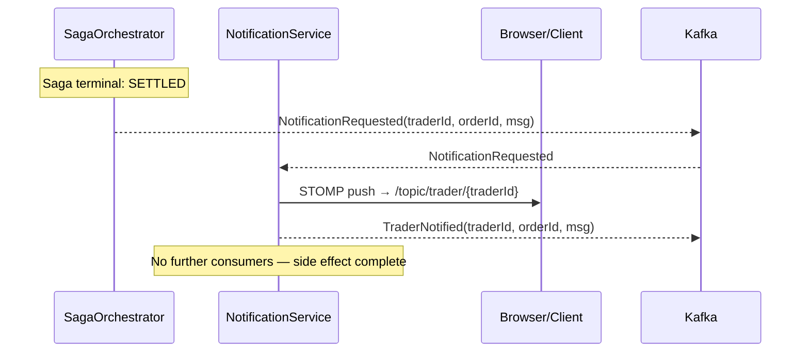

# FEAT-010: Notification Service — WebSocket Push for Real-Time Order Status

Status: complete
Date: 2026-03-29
Author: Claude

---

## Context & Motivation

The NotificationService has been a log-only stub since FEAT-004. It consumes
`NotificationRequested` but never delivers anything to a real client and never
publishes `TraderNotified`.

This feature replaces the stub with a STOMP-over-WebSocket endpoint that pushes
order status updates to connected trader clients. When an order reaches `SETTLED`,
the trader's browser receives a real-time push notification without polling.

**Design rationale — notification as side effect:** The saga orchestrates the
business transaction (risk → execute → settle). Settlement is the irrevocable
event; the position is updated regardless of notification delivery. Notification
failure never warrants undoing a settled trade. Therefore the saga ends at
`SETTLED`, and `NotificationService` is a pure side-effect subscriber. The
`NOTIFICATION_SENT` SagaStep enum value is reserved for a future audit-tracking
feature but is not activated here.

After this feature, `TraderNotified` is published on `trader-notifications`,
a static HTML test client at `http://localhost:8090` demonstrates live pushes,
and all existing saga + order tests remain unchanged.

## Goals

- [x] Add `spring-boot-starter-websocket` to `:notification` module; expose on
      port 8090
- [x] STOMP WebSocket config: `/ws` handshake endpoint, simple in-memory broker,
      broker prefix `/topic`
- [x] On `NotificationRequested` consumed: broadcast STOMP message to
      `/topic/trader/{traderId}` AND publish `TraderNotified` to
      `trader-notifications` Kafka topic (best-effort; STOMP failure does not
      block Kafka publish)
- [x] Static HTML/JS test client (`src/main/resources/static/index.html`) —
      connects to `/ws`, subscribes to `/topic/trader/{traderId}`, displays
      incoming messages
- [x] Integration tests: `NotificationKafkaListener` → STOMP broadcast verified
      via `SimpMessagingTemplate` mock; `TraderNotified` published on Kafka
- [x] System-test: `NotificationTest` — place order → poll until saga step is
      `SETTLED` → verify `TraderNotified` is present on `trader-notifications`
      topic

## Non-Goals

- No changes to `SagaStep` enum activations, `SagaOrchestrator` step logic, or
  `OrderStatus` — `SETTLED` remains the saga terminal state
- No consumers of `TraderNotified` in SagaOrchestrator or OrderService
- No authentication or authorisation on WebSocket connections
- No persistent notifications (in-memory broker only; no database)
- No mobile push (APNs/FCM), email, or SMS delivery
- No reconnect/replay for clients offline during notification
- No multi-instance fan-out (single instance; external broker deferred)
- No TLS/WSS

## Architecture

### Ports & Network Listeners

Port agreed at spec time: 8090
Conflict check completed: yes — no conflict with other services (order: 8080, risk: 8081, execution: 8082, settlement: 8083, saga-orchestrator: 8085, Zipkin: 9411)

### Component Design

```
notifications topic
        │  (NotificationRequested)
        ▼
NotificationKafkaListener
        │
        ▼
NotificationService.notify(traderId, orderId, message)
        │
        ├── SimpMessagingTemplate.convertAndSend(
        │       "/topic/trader/{traderId}",
        │       NotificationPayload(orderId, message, timestamp)
        │   )   ← fire-and-forget; no downstream dependency
        │
        └── NotificationEventPublisher.publishTraderNotified(traderId, orderId, message)
                → trader-notifications topic
```

### WebSocket / STOMP Config

```
WebSocket endpoint:  ws://localhost:8090/ws
STOMP destination:   /topic/trader/{traderId}
Message broker:      In-memory (SimpleBroker)
```

### Kafka

**Consumer** (group-id `notification-service`):

| Topic | Event | Handler |
|---|---|---|
| `notifications` | `NotificationRequested(traderId, orderId, message)` | `NotificationKafkaListener.onNotificationRequested()` |

**Producer** (key = `orderId.toString()`):

| Topic | Event | Trigger |
|---|---|---|
| `trader-notifications` | `TraderNotified(traderId, orderId, message)` | After STOMP broadcast attempt |

No new consumers on `trader-notifications`. SagaOrchestrator and OrderService
are unchanged.

### Key Flow



## Data Model

### `NotificationPayload` (DTO, not persisted)

```kotlin

data class NotificationPayload(
    val orderId: UUID,
    val message: String,
    val timestamp: Instant
)
```

### No changes to existing entities or enums

`NOTIFICATION_SENT` remains in the `SagaStep` enum as a reserved value:
```kotlin
NOTIFICATION_SENT  // reserved — not yet activated; see FEAT-010 design notes
```

## API Surface / Interface

| Interface | Type | Description |
|---|---|---|
| `ws://localhost:8090/ws` | WebSocket (STOMP) | Handshake endpoint for trader clients |
| `/topic/trader/{traderId}` | STOMP destination | Per-trader push channel |
| `GET http://localhost:8090/` | HTTP | Static HTML test client |
| `notifications` topic | Kafka consumer | Receives `NotificationRequested` |
| `trader-notifications` topic | Kafka producer | Publishes `TraderNotified` |

## Edge Cases & Error Handling

| Scenario | Expected Behavior |
|---|---|
| No client subscribed to `/topic/trader/{traderId}` | STOMP broadcast silently dropped; `TraderNotified` still published to Kafka |
| STOMP send throws | Log ERROR; still publish `TraderNotified` to Kafka |
| Kafka publish of `TraderNotified` fails | Log ERROR; STOMP already delivered; no retry (side effect only) |

## Configuration

### `:notification` build.gradle.kts additions

```kotlin
implementation("org.springframework.boot:spring-boot-starter-websocket")
```

### `:notification` `src/main/resources/application.yml`

```yaml
server:
  port: 8090

spring:
  kafka:
    bootstrap-servers: localhost:9092
    producer:
      value-serializer: org.springframework.kafka.support.serializer.JsonSerializer
    consumer:
      group-id: notification-service
      value-deserializer: org.springframework.kafka.support.serializer.ErrorHandlingDeserializer
      properties:
        spring.deserializer.value.delegate.class: org.springframework.kafka.support.serializer.JsonDeserializer
        spring.json.trusted.packages: "de.antrophos.demo.spring.kafka.trader.shared.events,de.antrophos.demo.spring.kafka.trader.shared.domain"
        spring.json.use.type.headers: true
```

### `:notification` `src/test/resources/application.yml`

```yaml
spring:
  kafka:
    bootstrap-servers: localhost:9999
    producer:
      value-serializer: org.springframework.kafka.support.serializer.JsonSerializer
    consumer:
      group-id: notification-service
      value-deserializer: org.springframework.kafka.support.serializer.ErrorHandlingDeserializer
      properties:
        spring.deserializer.value.delegate.class: org.springframework.kafka.support.serializer.JsonDeserializer
        spring.json.trusted.packages: "de.antrophos.demo.spring.kafka.trader.shared.events,de.antrophos.demo.spring.kafka.trader.shared.domain"
        spring.json.use.type.headers: true
    listener:
      auto-startup: false
```

## Acceptance Criteria

- [x] `./gradlew :notification:test` — all tests pass; STOMP broadcast verified
      via `SimpMessagingTemplate` mock; `TraderNotified` published to
      `trader-notifications`
- [x] `docker compose -f docker-compose.full.yml up -d` → open
      `http://localhost:8090`, subscribe to `/topic/trader/T001`, place order
      → push notification received in browser when saga reaches SETTLED
- [x] System-test: `NotificationTest` — place order → saga reaches `SETTLED` →
      `TraderNotified` message present on `trader-notifications` Kafka topic
- [x] No changes to existing system-test assertions (`HappyPathSagaFlowTest`
      still expects `SETTLED` as the terminal saga step)

## Implementation Notes

The STOMP WebSocket endpoint uses SockJS (`registry.addEndpoint("/ws").withSockJS()`) for broader client compatibility. The `/app` application destination prefix is configured but not used by any controller in this feature — the service only pushes via `SimpMessagingTemplate`, it does not subscribe to client-sent STOMP frames.

## Related Docs

- [FEAT-004: Saga Orchestrator](FEAT-004-saga-orchestrator.md)
- [Architecture](../arch/architecture.md)
