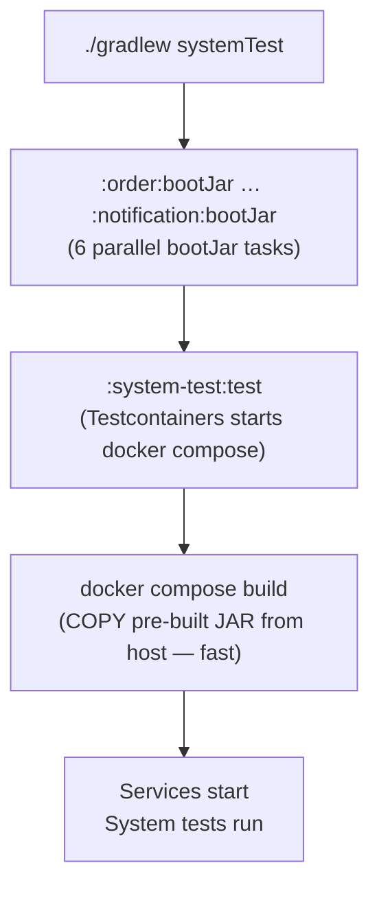
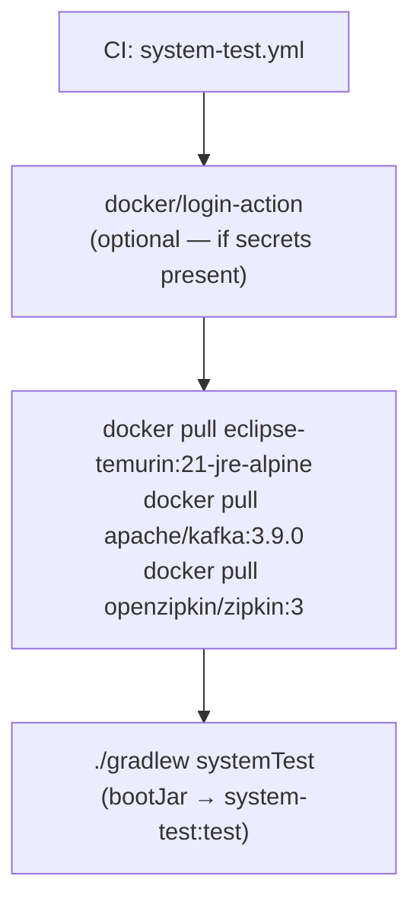

# FEAT-013: CI and Docker Build Reliability — Pre-built JARs, Gradle Task Aliases, and Rate Limit Mitigations

Status: complete
Date: 2026-03-29
Author: Claude

## Context & Motivation

Two related pain points surfaced after BUG-004 and BUG-005 fixes:

1. **System test hangs / slow CI builds.** Each service Dockerfile runs `./gradlew :service:bootJar` inside Docker (two-stage build). This downloads Gradle dependencies inside Docker (no cache sharing with the host), pulls `eclipse-temurin:21-jdk-alpine` in addition to the JRE image, and can take 15–20 minutes on a cold CI runner or local Docker cache. After running `docker system prune`, the next run re-downloads everything from scratch.

2. **Docker Hub rate limits hit on shared GitHub Actions runners.** GitHub-hosted runners share outbound IPs. Anonymous Docker Hub pulls are capped at 100 per 6 hours per IP — shared across all GitHub Actions users on that IP pool. After clearing local Docker caches the same throttling applies locally. Combined with the two-stage build pulling both JDK and JRE images, rate limit exhaustion causes intermittent `toomanyrequests` failures.

3. **Accumulated Docker data over time.** The current `docker system prune -f --volumes` command cleans everything — including pulled images — meaning the next run re-downloads all base images. Routine cleanup should target data volumes only; image cleanup should be a separate, deliberate operation.

## Goals

- [x] Simplify all 6 service Dockerfiles to single-stage: copy pre-built JAR from host into JRE image (eliminates JDK image dependency)
- [x] Add `systemTest` Gradle task that builds all bootJars then runs system tests (enforces correct ordering)
- [x] Add `unitTest` Gradle task alias for `test -x :system-test:test` (local convenience, mirrors CI)
- [x] Add `dockerVolumeClean` Gradle task for routine data volume cleanup (preserves images)
- [x] Add `dockerImageClean` Gradle task for explicit image cleanup (separate, deliberate operation)
- [x] Update CI `system-test.yml` to use `./gradlew systemTest`
- [x] Add Docker Hub pre-pull step to CI (unconditional — reduces total pulls to 3 unique images)
- [x] Add optional Docker Hub login step to CI (guarded by secrets — raises rate limit from shared-IP anonymous to per-account)
- [x] Update `README.md` "Running Tests" section: document `unitTest` and `systemTest` aliases; add system test prerequisites (Docker must be running)
- [x] Update `README.md` "Full Docker Workflow" section: correct the `--build` description (no longer builds JARs from source); add `./gradlew bootJar` prerequisite step

## Non-Goals

- Docker BuildKit layer caching in CI (pre-pull achieves sufficient reduction; full `cache-from: type=gha` adds complexity with diminishing return given single-stage Dockerfiles)
- Switching base images to a different registry (e.g., `ghcr.io` mirrors)
- Gradle version or Spring Boot version upgrades
- Maven Central proxy or local mirror setup (CI Gradle cache already protects against rate limits)

## Architecture

This feature introduces no new services, Kafka topics, or ports. It is a build-system and CI tooling change affecting:

- All 6 service `Dockerfile` files (single-stage, copy pre-built JAR)
- Root `build.gradle.kts` (new Gradle task aliases)
- `.github/workflows/system-test.yml` (new task invocation, pre-pull, optional login)

### Ports & Network Listeners

Port agreed at spec time: none — no new listeners introduced
Conflict check completed: not applicable

### Build Sequence (After Change)





### Key Flows

No inter-service event flows change. The build ordering is the critical flow:

**Before:** `docker compose build` → pulls JDK image → downloads Gradle deps inside Docker → compiles + packages JAR → copies to JRE stage

**After:** `./gradlew :service:bootJar` (host, cached) → `docker compose build` → `COPY build/libs/*.jar app.jar` → done

## Data Model

Not applicable — no domain entities, schemas, or events are modified by this feature.

## API Surface / Interface

### Gradle Tasks (new)

| Task | Invocation | Description |
|---|---|---|
| `unitTest` | `./gradlew unitTest` | Run all unit/integration tests, excluding `:system-test:test` |
| `systemTest` | `./gradlew systemTest` | Build all bootJars, then run `:system-test:test` |
| `dockerVolumeClean` | `./gradlew dockerVolumeClean` | `docker volume prune -f` — removes data volumes, preserves images |
| `dockerImageClean` | `./gradlew dockerImageClean` | `docker system prune -f` — removes unused images; use sparingly |

### Dockerfile contract (changed)

All service Dockerfiles change from two-stage (build + run) to single-stage (run only):

```dockerfile
FROM eclipse-temurin:21-jre-alpine
WORKDIR /app
COPY <service>/build/libs/*.jar app.jar
EXPOSE <port>
ENTRYPOINT ["java", "-jar", "app.jar"]
```

**Constraint:** `docker compose -f docker-compose.full.yml build` requires that `./gradlew :<service>:bootJar` has been run first for each service. The `systemTest` task enforces this. Running `docker compose build` directly without prior JAR build will fail with a COPY error.

### CI workflow change

`system-test.yml` "Run system tests" step:
- Before: `run: ./gradlew :system-test:test`
- After: `run: ./gradlew systemTest`

Two new steps added before the test step:
1. `docker/login-action@v3` (conditional: `if: ${{ secrets.DOCKERHUB_USERNAME != '' }}`)
2. `docker pull` for the 3 base images

## Edge Cases & Error Handling

| Scenario | Expected Behavior |
|---|---|
| `docker compose build` run without prior `./gradlew bootJar` | Build fails: `COPY failed: file not found in build context: <service>/build/libs/*.jar`. User must run `./gradlew systemTest` or `./gradlew :<service>:bootJar` first. This is intentional — the task alias enforces the correct workflow. |
| Docker Hub rate limit hit despite pre-pull | Pre-pull reduces unique pulls from N (one per service build) to 3 (one per unique image). If rate limit is still hit, adding `DOCKERHUB_USERNAME` / `DOCKERHUB_TOKEN` as GitHub Actions secrets activates the login step and moves to per-account limits. |
| `DOCKERHUB_USERNAME` secret not set | Login step is skipped silently (`if:` guard evaluates false). Pre-pull still runs; CI proceeds with anonymous rate limit. |
| `./gradlew dockerVolumeClean` while services are running | `docker volume prune` only removes volumes not attached to a running container. Running services are unaffected. |
| New service added to the project | New Dockerfile must follow the pre-built JAR pattern. New `:<service>:bootJar` dependency must be added to the `systemTest` task's `dependsOn` list in root `build.gradle.kts`. |

## Acceptance Criteria

- [x] `./gradlew systemTest` builds all 6 service bootJars then runs `:system-test:test` end-to-end; system tests pass
- [x] `./gradlew unitTest` runs all tests excluding the `:system-test` module
- [x] All 6 service Dockerfiles contain no `./gradlew` invocations; each has a single `FROM eclipse-temurin:21-jre-alpine` stage
- [x] `docker compose -f docker-compose.full.yml build` succeeds when called after `./gradlew bootJar` for all services
- [x] CI `system-test.yml` uses `./gradlew systemTest` and passes end-to-end on GitHub Actions
- [x] `./gradlew dockerVolumeClean` removes Docker volumes without removing pulled images
- [x] Docker Hub login step in `system-test.yml` is guarded and skips silently when secrets are absent
- [x] `README.md` "Running Tests" section documents `./gradlew unitTest` and `./gradlew systemTest` with Docker prerequisite for the latter
- [x] `README.md` "Full Docker Workflow" section no longer states that `--build` builds JARs from source; includes `./gradlew bootJar` as a prerequisite step

## Implementation Notes

**`mustRunAfter` → `dependsOn` in `system-test/build.gradle.kts`**

The spec used `mustRunAfter` to order `:system-test:test` after the 6 `bootJar` tasks. This only controls ordering when both tasks are present in the same Gradle invocation — it does not add them as prerequisites when `:system-test:test` is called directly. As a result, `./gradlew :system-test:test` failed with `ContainerLaunchException` because the service JARs were not built.

Decision: replaced `mustRunAfter` with `dependsOn`. This makes `:system-test:test` always build all 6 service JARs first, regardless of how it is invoked. `./gradlew clean test` (root-level batch) and `./gradlew :system-test:test` both work correctly. The `systemTest` root task remains as a convenience alias but is now functionally equivalent to `:system-test:test`.

## Related Docs

- [ADR-002: Testcontainers DockerCompose for E2E system tests](../arch/adr/ADR-002-testcontainers-dockercompose-for-e2e-tests.md) — established the `docker-compose.full.yml` wrapping pattern; this feature improves the build speed noted as a trade-off in ADR-002
- [ADR-003: Pre-built JAR pattern for service Dockerfiles](../arch/adr/ADR-003-pre-built-jar-dockerfile-pattern.md)
- [FEAT-007: System Test Module](../features/FEAT-007-system-test-module-e2e-tests.md)
- [FEAT-012: Java 21 Upgrade, Unit Test CI, and System Test Reliability](../features/FEAT-012-java-21-upgrade-unit-test-ci-system-test-reliability.md)
