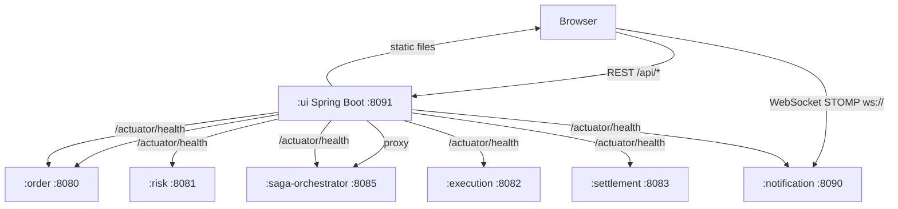
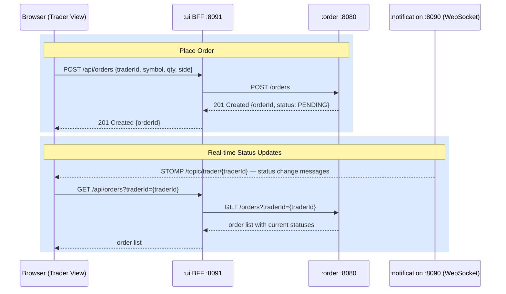
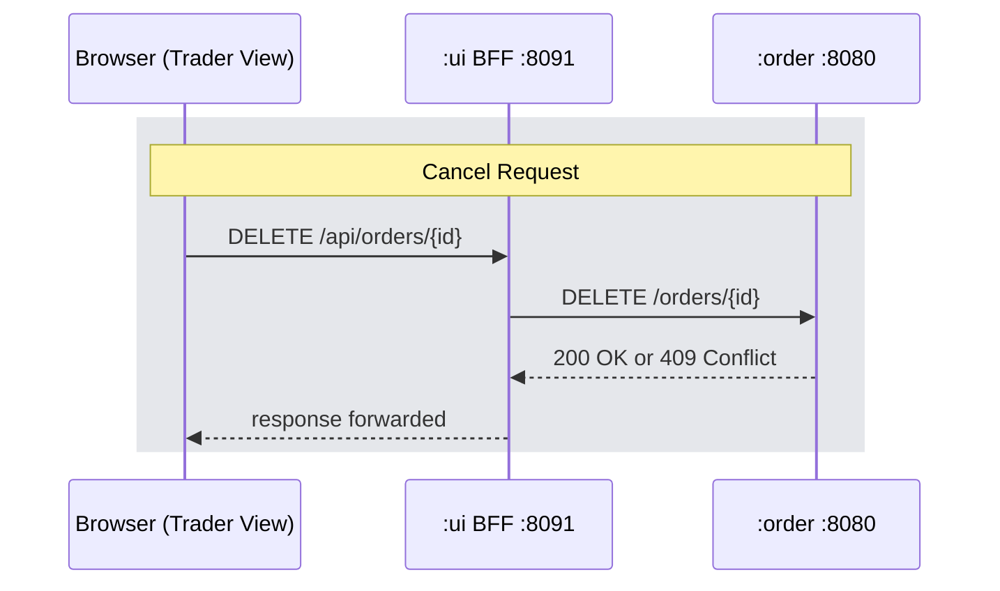
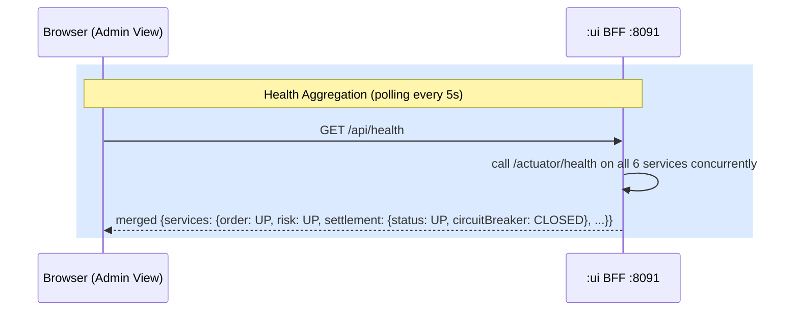

# FEAT-014: Web UI — React Trader and Admin Dashboard

Status: in-progress
Date: 2026-04-05
Author: Claude

---

## Context & Motivation

The Trade Execution Platform exposes its functionality entirely through REST endpoints and Kafka. Operators and traders interact with it via `curl` or Kafka tooling. A Web UI makes the platform accessible for demos, onboarding, and manual testing without requiring command-line knowledge. The notification service already provides WebSocket/STOMP push — a UI can connect to it for real-time order status without new infrastructure.

## Goals

- [ ] Trader view: place an order, watch status update in real time, cancel an in-flight order
- [ ] Admin view: monitor all sagas, all orders, and aggregated service health (including Resilience4j circuit breaker state)
- [ ] New `:ui` Gradle module — Spring Boot BFF (port 8091) that proxies React REST calls to backend services and serves the built React app as static files
- [ ] React + Vite SPA, integrated into the Gradle build via the node-gradle plugin
- [ ] Zero authentication — trader ID is a free-text field; all views publicly accessible
- [ ] Full Docker support: `:ui` service added to `docker-compose.full.yml` following the pre-built JAR pattern (ADR-003)

## Non-Goals

- Authentication or role-based access control
- Order history filtering or position summary display beyond what OrderService already returns
- WebSocket proxying through the BFF (React connects directly to NotificationService STOMP endpoint)
- A new Kafka topic or domain event — this feature is pure UI + BFF, no domain logic changes
- E2E automated tests (manual testing via `docker-compose.full.yml` is sufficient for this feature)

## Architecture

### Approach: BFF (Backend for Frontend)

The `:ui` Spring Boot module acts as a single-origin proxy. React calls only `localhost:8091/api/*`; Spring Boot fans out to the appropriate backend service. This avoids CORS configuration on existing services and decouples the React app from the service topology.

**Exception:** Real-time trader notifications connect directly from the browser to NotificationService WebSocket (`ws://localhost:8090/ws`) via STOMP. Proxying a persistent WebSocket through the BFF adds complexity with no benefit.

### Ports & Network Listeners

Port agreed at spec time: 8091
Conflict check completed: yes — existing ports 8080, 8081, 8082, 8083, 8085, 8090 verified in `docs/arch/architecture.md`



### Key Flows

#### Trader Places an Order



#### Trader Cancels an Order



#### Admin Views System Health



## Data Model

No new domain entities or Kafka events. The BFF passes through data from existing services unchanged (except the health aggregation which merges six responses).

## API Surface / Interface

### BFF REST Endpoints (`:ui` Spring Boot, port 8091)

| Method | Path | Proxies to | Notes |
|---|---|---|---|
| `POST` | `/api/orders` | `POST :8080/orders` | Forwards body and returns upstream response |
| `GET` | `/api/orders` | `GET :8080/orders` | Accepts `?traderId=` query param |
| `DELETE` | `/api/orders/{id}` | `DELETE :8080/orders/{id}` | Forwards 200 or 409 as-is |
| `GET` | `/api/sagas` | `GET :8085/sagas` | Forwards response as-is |
| `GET` | `/api/health` | Aggregates all 6 `/actuator/health` | Returns merged health JSON |

### React Pages

| Route | Component | Description |
|---|---|---|
| `/` | `TraderPage` | Order form + order list with real-time status |
| `/admin` | `AdminPage` | Stacked: health panel, saga table, all-orders table |

### React Components

| Component | Purpose |
|---|---|
| `OrderForm` | Fields: traderId, symbol, qty, side (BUY/SELL); submits `POST /api/orders` |
| `OrderList` | Table of orders for current traderId; cancel button per row |
| `OrderRow` | Single order row; cancel calls `DELETE /api/orders/{id}` |
| `SagaTable` | Polls `GET /api/sagas` every 5s; shows sagaId, orderId, state |
| `AllOrdersTable` | Polls `GET /api/orders` every 5s (no traderId filter) |
| `HealthPanel` | Polls `GET /api/health` every 5s; badge per service (UP/DOWN/DEGRADED) |

### React Hooks

| Hook | Responsibility |
|---|---|
| `useOrders(traderId)` | Fetches orders on mount and on WebSocket notification; returns order list |
| `useTraderNotifications(traderId, onMessage)` | Opens STOMP WebSocket to `ws://localhost:8090/ws`, subscribes to `/topic/trader/{traderId}`, calls `onMessage` on each frame |

## Edge Cases & Error Handling

| Scenario | Expected Behavior |
|---|---|
| Cancel a non-PENDING order | BFF forwards `409 Conflict` from OrderService; UI shows error toast |
| Backend service down during health poll | Individual service marked `DOWN` in health panel; other services unaffected |
| Backend service down during order submit | BFF returns 502; UI shows "order service unavailable" error |
| WebSocket connection lost | `useTraderNotifications` attempts reconnect with exponential backoff; orders fall back to 5s polling |
| Trader submits order with empty traderId | Client-side validation in `OrderForm` blocks submission before network call |

## Configuration

### `ui/src/main/resources/application.yml`

```yaml
server:
  port: 8091

services:
  order-url: http://localhost:8080
  saga-url: http://localhost:8085
  risk-url: http://localhost:8081
  execution-url: http://localhost:8082
  settlement-url: http://localhost:8083
  notification-url: http://localhost:8090
```

Docker overrides these via environment variables (`SERVICES_ORDER_URL`, etc.).

### `ui/src/main/resources/application.yml` — SPA fallback

Spring Boot must forward any unmatched path (e.g., `/admin`, `/admin/anything`) to `index.html` so React Router handles routing client-side. Implemented via a `WebConfig` forwarding rule.

### Vite dev proxy (`vite.config.ts`)

```ts
server: {
  proxy: {
    '/api': 'http://localhost:8091'
  }
}
```

Allows React dev server (`localhost:5173`) to call the BFF during development without CORS issues.

## Acceptance Criteria

- [ ] `./gradlew :ui:bootRun` starts Spring Boot on port 8091 serving the React app at `/`
- [ ] Trader can type a traderId, symbol, quantity, and side; submit creates an order and the new order appears in the list
- [ ] Order status in the list updates in real time when STOMP notifications arrive
- [ ] Trader can click Cancel on a PENDING order; the order status updates to `CANCELLATION_IN_PROGRESS`
- [ ] Admin page at `/admin` shows sagas table, all-orders table, and health panel
- [ ] Health panel shows UP/DOWN per service; Resilience4j state is visible in the settlement service entry
- [ ] `docker-compose.full.yml` includes the `ui` service; `docker compose up --build` (after JAR pre-build) serves the UI at `http://localhost:8091`
- [ ] `./gradlew :ui:test` runs BFF proxy controller unit tests with `MockRestServiceServer`

## Implementation Notes

> Agent: fill this section during feature-impl if implementation differs from spec.

## Related Docs

- [FEAT-010: Notification Service — WebSocket Push](FEAT-010-notification-service.md)
- [FEAT-011: Cancel In-Flight Orders](FEAT-011-cancel-in-flight-orders.md)
- [ADR-003: Pre-built JAR pattern](../arch/adr/ADR-003-pre-built-jar-dockerfile-pattern.md)
- [PLAN-014: Implementation Plan](../plans/PLAN-014-web-ui.md)
