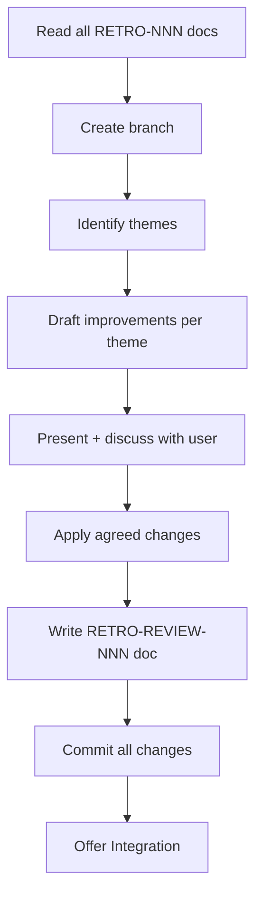
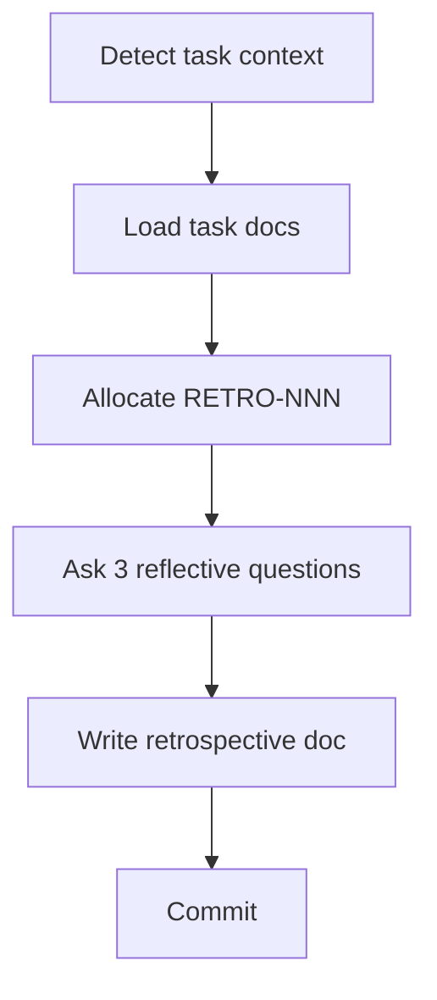

# Agent-Agnostic Workflow Architecture Implementation Plan

> **For Claude:** REQUIRED SUB-SKILL: Use superpowers:executing-plans to implement this plan task-by-task.

**Goal:** Restructure the workflow system so `docs/workflows/` is the single agent-agnostic source of truth, with thin adapter layers for Claude Code and opencode + qwen3-coder.

**Architecture:** `docs/workflows/` holds plain-language workflow steps (no tool references). `.claude/skills/` becomes thin shims with YAML frontmatter + tool-mapping table. `.opencode/` adds interactive-by-default guidance with plan-first deferred-write mode. `AGENTS.md` documents the split and includes the tool-mapping reference table.

**Tech Stack:** Markdown only — no source code changes.

---

## Setup: Branch and Registry

### Task 1: Allocate RETRO-REVIEW-004 and create branch

**Files:**
- Modify: `docs/registry.md`

**Step 1: Add registry row**

In `docs/registry.md`, add this row at the bottom of the table:
```
| RETRO-REVIEW-004 | RETRO-REVIEW | Agent-agnostic workflow architecture | in-progress |
```

**Step 2: Verify the row was added**

Read `docs/registry.md` and confirm the RETRO-REVIEW-004 row exists.

**Step 3: Create branch**

```bash
git checkout main
```
```bash
git pull
```
```bash
git checkout -b chore/workflow-process-review-004
```

**Step 4: Commit registry entry**

```bash
git add docs/registry.md
```
```bash
git commit -m "chore(RETRO-REVIEW-004): allocate ID for agent-agnostic workflow architecture"
```

---

## Phase 1: Update `docs/workflows/` (source of truth)

### Task 2: Create `docs/workflows/workflow-process-review.md`

This replaces `docs/workflows/retro-review.md` with corrections:
- Branch name updated to `chore/workflow-process-review-NNN`
- STEP 5 table updated: edit `docs/workflows/` only (not `.claude/skills/`)
- Completion checklist added

**Files:**
- Create: `docs/workflows/workflow-process-review.md`

**Step 1: Write the file**

Create `docs/workflows/workflow-process-review.md` with this content:

```markdown
# Workflow Process Review



## Context Budget

Files to read:
- All `docs/retrospectives/RETRO-NNN-*.md` files (use glob)
- All `docs/retrospectives/RETRO-REVIEW-NNN.md` files — read to identify which retros are already reviewed
- `AGENTS.md` (for potential updates)
- Any specific workflow or feature doc flagged for improvement

---

## Steps

### STEP 1: Read All Retrospectives

Use glob to list all files matching `docs/retrospectives/RETRO-[0-9]*.md`.

Read each one. For any `RETRO-REVIEW-NNN.md` files that exist, read them to determine which retrospectives have already been reviewed — focus analysis on the **unreviewed** ones, but note any recurring patterns from older ones too.

### STEP 1b: Create Branch

Before making any changes, allocate the RETRO-REVIEW ID and create a branch:

1. Read `docs/registry.md`, find the highest existing RETRO-REVIEW-NNN, allocate the next number
2. Add a row to the registry immediately: `| RETRO-REVIEW-NNN | RETRO-REVIEW | [session date] | in-progress |`
3. Create the branch:

```bash
git checkout main
git pull
git checkout -b chore/workflow-process-review-NNN
```

All workflow edits and the review doc commit go on this branch.

### STEP 2: Identify Themes

Group friction points and suggestions across all retrospectives by category:

| Category | Description |
|---|---|
| **Context Loading** | Too many files read, wrong files loaded, context overflows |
| **Spec Clarity** | Ambiguous requirements, missing edge cases, vague acceptance criteria |
| **Test Coverage** | Test gaps, unclear test descriptions, tests that don't catch real bugs |
| **Workflow Steps** | Steps that are confusing, missing, in the wrong order, or unnecessary |
| **Git Flow** | Branching, commit, or PR issues |
| **Documentation** | Docs too long, outdated, inconsistent, missing |
| **Other** | Anything not captured above |

For each category: list the RETRO IDs that mention it and count occurrences.

### STEP 3: Draft Improvements

For each category with **2 or more mentions**, draft 2–3 actionable improvements:
- Identify the specific friction from the retrospectives
- Propose a concrete change (edit a workflow, add a step, remove a step, update a template, etc.)
- Reference the RETRO IDs as evidence

### STEP 4: Present and Discuss

Present the analysis to the user:

> "I reviewed [N] retrospectives. Here are the recurring themes:
>
> **[Category]** (mentioned N times: RETRO-001, RETRO-003)
> - [Description of friction]
> - Proposed fix: [specific change]
>
> [repeat for each theme]
>
> Which of these do you want to act on?"

Discuss each proposed change. Some may need adjustment. Agree on a prioritized list before making any changes.

### STEP 5: Apply Agreed Changes

For each agreed improvement, make the change:

| Target | Action |
|---|---|
| Workflow | Edit `docs/workflows/[workflow].md` |
| AGENTS.md | Edit `AGENTS.md` |
| Feature spec | Edit `docs/features/FEAT-NNN-*.md` |
| Document template | Edit `docs/templates/[template].md` |

**Important:** `docs/workflows/` is the source of truth. `.claude/skills/` shims contain no workflow logic — do not edit them for workflow changes. Edit only `docs/workflows/`.

Commit each logical group of changes:
```
chore: [brief description of improvement] — workflow process review finding
```

### STEP 6: Write Review Doc

1. Use the RETRO-REVIEW-NNN allocated and registered in STEP 1b
2. Copy `docs/templates/retro-review-template.md` to `docs/retrospectives/RETRO-REVIEW-NNN.md`
3. Fill:
   - Retrospectives reviewed (list RETRO IDs)
   - Previously reviewed up to (highest RETRO-REVIEW NNN before this one, if any)
   - Themes found with examples and agreed actions
   - Changes made (list of files updated)
4. Commit: `chore(RETRO-REVIEW-NNN): workflow process review — [one-line theme summary]`

### STEP 7: Offer Integration

Ask the user:
> "The workflow process review changes are on `chore/workflow-process-review-NNN`. How would you like to integrate them?
> - **A) Open a pull/merge request** — create a PR/MR for review
> - **B) Merge locally** — merge into main now
> - **C) Keep on branch** — continue work before integrating"

If **B**: confirm explicitly with the user before merging.

---

## Completion Checklist

Use this to verify the workflow was followed completely before declaring done:

- [ ] RETRO-REVIEW-NNN allocated and row added to `docs/registry.md` immediately (STEP 1b)
- [ ] Branch created: `chore/workflow-process-review-NNN`
- [ ] All unreviewed RETRO-NNN documents read (STEP 1)
- [ ] Themes identified and presented to user (STEP 2–4)
- [ ] All agreed improvements applied to `docs/workflows/` files (STEP 5)
- [ ] Commits made for each logical group of changes
- [ ] `docs/retrospectives/RETRO-REVIEW-NNN.md` written and committed (STEP 6)
- [ ] RETRO-REVIEW-NNN status updated to `complete` in `docs/registry.md`
- [ ] Offer Integration step presented to user (STEP 7)
```

**Step 2: Verify**

Read `docs/workflows/workflow-process-review.md` and confirm:
- STEP 5 table references `docs/workflows/` only (no `.claude/skills/` reference)
- Branch name in STEP 1b says `chore/workflow-process-review-NNN`
- Completion Checklist section is present at the bottom

**Step 3: Commit**

```bash
git add docs/workflows/workflow-process-review.md
```
```bash
git commit -m "chore: add workflow-process-review.md as agent-agnostic source of truth"
```

---

### Task 3: Create `docs/workflows/retrospective.md` (new standalone workflow)

**Files:**
- Create: `docs/workflows/retrospective.md`

**Step 1: Write the file**

Create `docs/workflows/retrospective.md` with this content:

```markdown
# Retrospective Workflow

> Trigger: "run retrospective"
> Use when: After completing any feature-spec, feature-impl, or bug-fix workflow — or any time you want to reflect on a recently completed task.
> Produces: `docs/retrospectives/RETRO-NNN-[type]-[related-id].md`



## Context Budget

Read at STEP 2 (after task context is identified):
- The identified spec, plan, or bug report for the current task

---

## Steps

### STEP 1: Detect Task Context

Read the current git branch name to identify the task:

```bash
git branch --show-current
```

- Branch `feat/FEAT-NNN-*` → task is FEAT-NNN; note workflow type as `feature-spec` or `feature-impl` (ask the user which if unclear)
- Branch `fix/BUG-NNN-*` → task is BUG-NNN; workflow type is `bug-fix`
- Any other branch → ask the user: "What task is this retrospective for? (e.g., FEAT-011 or BUG-006)"

### STEP 2: Load Task Context

Read the identified documents:
- For FEAT-NNN: read `docs/features/FEAT-NNN-*.md` and (if implementation is done) `docs/plans/PLAN-NNN-*.md`
- For BUG-NNN: read `docs/bugs/BUG-NNN-*.md`

This gives context for the reflective questions.

### STEP 3: Allocate RETRO-NNN

1. Read `docs/registry.md`, find the highest existing RETRO-NNN, allocate next
2. Add a row immediately: `| RETRO-NNN | RETRO | [workflow-type] retrospective for [FEAT/BUG-NNN] | complete |`

> **✅ Gate — ID Allocated**
> Write the registry row before writing the retrospective doc.

### STEP 4: Ask Reflective Questions

Ask these three questions **one at a time**. Wait for each answer:

1. "What went well in this [workflow-type] session?"
2. "What was difficult or caused friction?"
3. "What's one thing you'd improve about the workflow or process next time?"

### STEP 5: Write Retrospective Doc

1. Copy `docs/templates/retrospective-template.md` to:
   `docs/retrospectives/RETRO-NNN-[workflow-type]-[FEAT/BUG-NNN].md`
   (e.g., `RETRO-022-feature-impl-FEAT-011.md`)
2. Fill in:
   - Date: today
   - Workflow: feature-spec | feature-impl | bug-fix
   - Related: FEAT-NNN or BUG-NNN
   - What Went Well: from STEP 4 answer 1
   - What Was Difficult: from STEP 4 answer 2
   - Suggested Improvements: from STEP 4 answer 3 (max 3, each actionable)

### STEP 6: Commit

```bash
git add docs/registry.md docs/retrospectives/RETRO-NNN-*.md
git commit -m "chore(RETRO-NNN): [workflow-type] retrospective for [FEAT/BUG-NNN]"
```

---

## Completion Checklist

- [ ] Task context detected (FEAT-NNN or BUG-NNN identified, STEP 1)
- [ ] Task documents read for context (STEP 2)
- [ ] RETRO-NNN allocated and row added to `docs/registry.md` immediately (STEP 3)
- [ ] Three reflective questions asked and answered (STEP 4)
- [ ] `docs/retrospectives/RETRO-NNN-[type]-[related-id].md` written (STEP 5)
- [ ] Registry row status is `complete`
- [ ] Commit made with correct format (STEP 6)
```

**Step 2: Commit**

```bash
git add docs/workflows/retrospective.md
```
```bash
git commit -m "chore: add standalone retrospective workflow with git branch context detection"
```

---

### Task 4: Add Completion Checklist to `docs/workflows/feature-spec.md`

**Files:**
- Modify: `docs/workflows/feature-spec.md`

**Step 1: Append checklist after STEP 13**

At the end of `docs/workflows/feature-spec.md`, append:

```markdown

---

## Completion Checklist

Use this to verify the workflow was followed completely before declaring done:

- [ ] FEAT-NNN allocated and row added to `docs/registry.md` immediately (STEP 1)
- [ ] PLAN-NNN allocated and row added to `docs/registry.md` (STEP 10)
- [ ] Branch created: `feat/FEAT-NNN-kebab-title` (STEP 2)
- [ ] `docs/features/FEAT-NNN-kebab-title.md` written (STEP 8)
- [ ] `docs/plans/PLAN-NNN-kebab-title.md` written with vertical slices (STEP 10)
- [ ] `docs/arch/architecture.md` updated if new components or decisions introduced (STEP 9)
- [ ] ADR written if a significant architectural decision was made (STEP 9)
- [ ] FEAT-NNN and PLAN-NNN status set to `complete` in `docs/registry.md` (STEP 11)
- [ ] Registry stub check: no orphan `draft` entries without a corresponding file (STEP 11)
- [ ] Offer Integration step presented to user (STEP 12)
- [ ] Retrospective offered — follow `docs/workflows/retrospective.md` if yes (STEP 13)
```

**Step 2: Verify**

Read the end of `docs/workflows/feature-spec.md` and confirm the Completion Checklist section is present.

**Step 3: Commit**

```bash
git add docs/workflows/feature-spec.md
```
```bash
git commit -m "chore: add completion checklist to feature-spec workflow"
```

---

### Task 5: Update `docs/workflows/feature-impl.md` — STEP 8 + checklist

**Files:**
- Modify: `docs/workflows/feature-impl.md`

**Step 1: Replace STEP 8 body**

Find the current STEP 8 content (lines ~199–211):
```
### STEP 8: Retrospective

> **✅ Gate — Retrospective**
> Always offer the retrospective and wait for the user's answer before proceeding to STEP 9.

Ask: "Would you like to add a retrospective for this implementation?"

If yes:
1. Allocate RETRO-NNN from registry
2. Copy `docs/templates/retrospective-template.md`
3. Write `docs/retrospectives/RETRO-NNN-impl-FEAT-NNN.md`
4. Commit: `chore(RETRO-NNN): feature impl retrospective for FEAT-NNN`
```

Replace with:
```
### STEP 8: Retrospective

> **✅ Gate — Retrospective**
> Always offer the retrospective and wait for the user's answer before proceeding to STEP 9.

Ask: "Would you like to add a retrospective for this implementation?"

If yes: follow `docs/workflows/retrospective.md`. Task context (FEAT-NNN, workflow type `feature-impl`) is already loaded — skip STEP 1 and STEP 2 of that workflow and start at STEP 3.
```

**Step 2: Append checklist after STEP 9**

At the end of `docs/workflows/feature-impl.md`, append:

```markdown

---

## Completion Checklist

Use this to verify the workflow was followed completely before declaring done:

- [ ] All vertical slices in `docs/plans/PLAN-NNN-*.md` marked `[x]` (STEP 4)
- [ ] Full test suite passes: `./gradlew :module:clean :module:test` (STEP 5)
- [ ] Implementation Review table written in `PLAN-NNN-*.md` with `Status: complete` (STEP 6)
- [ ] `## Progress` section removed from `PLAN-NNN-*.md` (STEP 6)
- [ ] `docs/arch/architecture.md` updated if implementation deviated from spec (STEP 7)
- [ ] ADR written if a new architectural decision was made (STEP 7)
- [ ] Retrospective offered — follow `docs/workflows/retrospective.md` if yes (STEP 8)
- [ ] Offer Integration step presented to user (STEP 9)
```

**Step 3: Commit**

```bash
git add docs/workflows/feature-impl.md
```
```bash
git commit -m "chore: update feature-impl STEP 8 to delegate to retrospective workflow, add checklist"
```

---

### Task 6: Update `docs/workflows/bug-fix.md` — STEP 11 + checklist

**Files:**
- Modify: `docs/workflows/bug-fix.md`

**Step 1: Replace STEP 11 body**

Find the current STEP 11 content (lines ~155–166):
```
### STEP 11: Retrospective

> **✅ Gate — Retrospective**
> Always offer the retrospective and wait for the user's answer before proceeding to STEP 12.

Ask: "Would you like to add a retrospective for this bug fix?"

If yes:
1. Allocate RETRO-NNN from registry
2. Copy `docs/templates/retrospective-template.md`
3. Write `docs/retrospectives/RETRO-NNN-bugfix-BUG-NNN.md`
4. Commit: `chore(RETRO-NNN): bug fix retrospective for BUG-NNN`
```

Replace with:
```
### STEP 11: Retrospective

> **✅ Gate — Retrospective**
> Always offer the retrospective and wait for the user's answer before proceeding to STEP 12.

Ask: "Would you like to add a retrospective for this bug fix?"

If yes: follow `docs/workflows/retrospective.md`. Task context (BUG-NNN, workflow type `bug-fix`) is already loaded — skip STEP 1 and STEP 2 of that workflow and start at STEP 3.
```

**Step 2: Append checklist after STEP 12**

At the end of `docs/workflows/bug-fix.md`, append:

```markdown

---

## Completion Checklist

Use this to verify the workflow was followed completely before declaring done:

- [ ] BUG-NNN allocated and row added to `docs/registry.md` immediately (Phase 2 STEP 1)
- [ ] Branch created: `fix/BUG-NNN-kebab-title` (Phase 2 STEP 2)
- [ ] `docs/bugs/BUG-NNN-kebab-title.md` created with all Phase 1 fields filled (Phase 2 STEP 1)
- [ ] Failing reproduction test written and confirmed to FAIL before fix (STEP 4)
- [ ] Fix implemented and all unit/integration tests pass (STEP 5–6)
- [ ] System tests run or user explicitly notified if Docker unavailable (STEP 7)
- [ ] `## Root Cause` and `## Fix Summary` filled in bug report (STEP 9)
- [ ] `## Progress` section removed from bug report (STEP 9)
- [ ] BUG-NNN status set to `resolved` in `docs/registry.md` (STEP 9)
- [ ] Retrospective offered — follow `docs/workflows/retrospective.md` if yes (STEP 11)
- [ ] Offer Integration step presented to user (STEP 12)
```

**Step 3: Commit**

```bash
git add docs/workflows/bug-fix.md
```
```bash
git commit -m "chore: update bug-fix STEP 11 to delegate to retrospective workflow, add checklist"
```

---

### Task 7: Add Completion Checklist to `docs/workflows/init-project.md`

**Files:**
- Modify: `docs/workflows/init-project.md`

**Step 1: Append checklist after STEP 8**

At the end of `docs/workflows/init-project.md`, append:

```markdown

---

## Completion Checklist

Use this to verify the workflow was followed completely before declaring done:

- [ ] Five Q&A questions asked and answered (STEP 2)
- [ ] `docs/project-idea.md` created (STEP 3)
- [ ] `docs/arch/architecture.md` skeleton created (STEP 4)
- [ ] `AGENTS.md` placeholders replaced with actual project values (STEP 5)
- [ ] `docs/registry.md` initialized with FEAT-000 row (STEP 6)
- [ ] Commit made: `chore: initialize project from template` (STEP 7)
```

**Step 2: Commit**

```bash
git add docs/workflows/init-project.md
```
```bash
git commit -m "chore: add completion checklist to init-project workflow"
```

---

### Task 8: Delete `docs/workflows/retro-review.md`

**Files:**
- Delete: `docs/workflows/retro-review.md`

**Step 1: Remove the old file**

```bash
git rm docs/workflows/retro-review.md
```

**Step 2: Commit**

```bash
git commit -m "chore: remove retro-review.md superseded by workflow-process-review.md"
```

---

## Phase 2: Convert `.claude/skills/` to Thin Shims

### Task 9: Convert `.claude/skills/feature-spec.md` to shim

**Files:**
- Modify: `.claude/skills/feature-spec.md`

**Step 1: Read current frontmatter**

Read `.claude/skills/feature-spec.md` lines 1–4 to get the exact `name` and `description` values.

**Step 2: Replace body**

Keep the YAML frontmatter exactly as-is. Replace everything after the closing `---` with:

```markdown
Follow the workflow defined in `docs/workflows/feature-spec.md` exactly.

## Claude Code Tool Mappings

| Workflow says...                        | Use this Claude Code capability                        |
|-----------------------------------------|--------------------------------------------------------|
| "Ask the user [question]"               | Conversational reply — no special tool needed          |
| "Present options and wait"              | Conversational reply                                   |
| "Read file [path]"                      | Read tool                                              |
| "Write file at [path]"                  | Write tool                                             |
| "Run bash command [cmd]"                | Bash tool (follow Bash Command Style in AGENTS.md)     |
| "Commit with message [msg]"             | Bash: `git add [files]` then `git commit -m "[msg]"`   |

## Claude Code-Specific Notes

- At workflow start, create a TaskCreate entry for each numbered step; mark complete with TaskUpdate as you go
- No writes to `/tmp` — use `build/agent-debug/` for any temp output
- No pipes, heredocs, or multiline bash strings — see Bash Command Style in AGENTS.md
- Final verification: use `./gradlew :module:clean :module:test` (not just `:module:test`)
```

**Step 3: Commit**

```bash
git add .claude/skills/feature-spec.md
```
```bash
git commit -m "chore: convert feature-spec skill to thin shim delegating to docs/workflows"
```

---

### Task 10: Convert `.claude/skills/feature-impl.md` to shim

**Files:**
- Modify: `.claude/skills/feature-impl.md`

**Step 1: Read current frontmatter** (lines 1–4)

**Step 2: Replace body** — same shim template as Task 9, pointing to `docs/workflows/feature-impl.md`

**Step 3: Commit**

```bash
git add .claude/skills/feature-impl.md
```
```bash
git commit -m "chore: convert feature-impl skill to thin shim delegating to docs/workflows"
```

---

### Task 11: Convert `.claude/skills/bug-fix.md` to shim

**Files:**
- Modify: `.claude/skills/bug-fix.md`

**Step 1: Read current frontmatter** (lines 1–4)

**Step 2: Replace body** — same shim template, pointing to `docs/workflows/bug-fix.md`

**Step 3: Commit**

```bash
git add .claude/skills/bug-fix.md
```
```bash
git commit -m "chore: convert bug-fix skill to thin shim delegating to docs/workflows"
```

---

### Task 12: Convert `.claude/skills/init-project.md` to shim

**Files:**
- Modify: `.claude/skills/init-project.md`

**Step 1: Read current frontmatter** (lines 1–4)

**Step 2: Replace body** — same shim template, pointing to `docs/workflows/init-project.md`

**Step 3: Commit**

```bash
git add .claude/skills/init-project.md
```
```bash
git commit -m "chore: convert init-project skill to thin shim delegating to docs/workflows"
```

---

### Task 13: Create `.claude/skills/workflow-process-review.md` + delete `retro-review.md`

**Files:**
- Create: `.claude/skills/workflow-process-review.md`
- Delete: `.claude/skills/retro-review.md`

**Step 1: Create the new skill shim**

Create `.claude/skills/workflow-process-review.md`:

```markdown
---
name: workflow-process-review
description: Use to aggregate all retrospectives, identify recurring themes, and improve workflows. TRIGGER when user says "run workflow process review" or "run retrospective review". Should be run periodically — every 5–10 features or bugs is a good cadence.
---

Follow the workflow defined in `docs/workflows/workflow-process-review.md` exactly.

## Claude Code Tool Mappings

| Workflow says...                        | Use this Claude Code capability                        |
|-----------------------------------------|--------------------------------------------------------|
| "Ask the user [question]"               | Conversational reply — no special tool needed          |
| "Present options and wait"              | Conversational reply                                   |
| "Read file [path]"                      | Read tool                                              |
| "Write file at [path]"                  | Write tool                                             |
| "Run bash command [cmd]"                | Bash tool (follow Bash Command Style in AGENTS.md)     |
| "Commit with message [msg]"             | Bash: `git add [files]` then `git commit -m "[msg]"`   |

## Claude Code-Specific Notes

- At workflow start, create a TaskCreate entry for each numbered step; mark complete with TaskUpdate as you go
- No writes to `/tmp` — use `build/agent-debug/` for any temp output
- No pipes, heredocs, or multiline bash strings — see Bash Command Style in AGENTS.md
```

**Step 2: Delete the old skill**

```bash
git rm .claude/skills/retro-review.md
```

**Step 3: Commit**

```bash
git add .claude/skills/workflow-process-review.md
```
```bash
git commit -m "chore: rename retro-review skill to workflow-process-review, convert to shim"
```

---

### Task 14: Create `.claude/skills/retrospective.md`

**Files:**
- Create: `.claude/skills/retrospective.md`

**Step 1: Write the shim**

Create `.claude/skills/retrospective.md`:

```markdown
---
name: retrospective
description: Use to write a RETRO-NNN retrospective document for the current or most recently completed task. TRIGGER when user says "run retrospective" or "write retrospective". Auto-detects task context from the current git branch name.
---

Follow the workflow defined in `docs/workflows/retrospective.md` exactly.

## Claude Code Tool Mappings

| Workflow says...                        | Use this Claude Code capability                        |
|-----------------------------------------|--------------------------------------------------------|
| "Ask the user [question]"               | Conversational reply — no special tool needed          |
| "Read the current git branch name"      | Bash: `git branch --show-current`                      |
| "Read file [path]"                      | Read tool                                              |
| "Write file at [path]"                  | Write tool                                             |
| "Run bash command [cmd]"                | Bash tool (follow Bash Command Style in AGENTS.md)     |
| "Commit with message [msg]"             | Bash: `git add [files]` then `git commit -m "[msg]"`   |

## Claude Code-Specific Notes

- At workflow start, create a TaskCreate entry for each numbered step; mark complete with TaskUpdate as you go
- No writes to `/tmp` — use `build/agent-debug/` for any temp output
```

**Step 2: Commit**

```bash
git add .claude/skills/retrospective.md
```
```bash
git commit -m "chore: add retrospective skill shim for standalone retro trigger"
```

---

## Phase 3: Create `.opencode/` Adapter

### Task 15: Create `.opencode/workflow-adapter.md`

**Files:**
- Create: `.opencode/workflow-adapter.md`

**Step 1: Write the file**

Create `.opencode/workflow-adapter.md`:

```markdown
# opencode Workflow Adapter

Read this file at the start of every session. It defines how to run this project's
workflows in opencode with any model (including local models via ollama).

---

## Workflow Discovery

All workflows are defined in `docs/workflows/`. Read the relevant file and follow its steps.

| Trigger Phrase | Workflow File |
|---|---|
| "initialize project" | `docs/workflows/init-project.md` |
| "spec feature [name]" | `docs/workflows/feature-spec.md` |
| "plan first spec feature [name]" | `docs/workflows/feature-spec.md` (plan-first mode — see below) |
| "implement feature FEAT-NNN" | `docs/workflows/feature-impl.md` |
| "fix a bug" | `docs/workflows/bug-fix.md` |
| "run retrospective" | `docs/workflows/retrospective.md` |
| "run workflow process review" | `docs/workflows/workflow-process-review.md` |
| "run retrospective review" | `docs/workflows/workflow-process-review.md` (alias) |

---

## Default Mode: Interactive

Run all workflows in **interactive mode** by default. In interactive mode you can freely:
- Read files
- Ask the user questions
- Write files
- Run bash commands

All in the same session, in any order. There is no restriction on asking questions
mid-workflow. Most workflows should be run this way.

---

## Plan-First Mode (Optional)

Triggered when the user says **"plan first"** before the workflow trigger phrase, or when
opencode is in plan/read-only mode.

In plan-first mode, run the **entire workflow including all Q&A** normally — but
**defer all write and bash operations** until the user says **"implement"**.

### What to do at each deferred operation

**Write a file** — output the full intended content as a labeled fenced code block:

```
📄 docs/features/FEAT-012-cancel-orders.md
` ` `markdown
[full file content here]
` ` `
```

**Registry allocation** — state the ID you will assign:

```
📋 Will allocate FEAT-012 in docs/registry.md (next available after FEAT-011)
```

**Run a bash command** — show the command, don't execute:

```
🔧 Will run: git checkout -b feat/FEAT-012-cancel-orders
```

**Commit** — show the intended message, don't commit:

```
💾 Will commit: feat(FEAT-012): add feature spec and implementation plan
```

### End of plan-first mode

After all workflow steps are complete (including all Q&A), output this summary:

> "Planning complete. Here's what will be written when you say 'implement':
> - 📋 docs/registry.md — FEAT-012 and PLAN-012 rows
> - 📄 docs/features/FEAT-012-cancel-orders.md
> - 📄 docs/plans/PLAN-012-cancel-orders.md
> - 🔧 git checkout -b feat/FEAT-012-cancel-orders
> - 💾 commit: feat(FEAT-012): add feature spec and implementation plan
>
> Say **'implement'** to apply all of the above, or ask me to revise anything first."

### When the user says "implement"

Apply all deferred operations in the order they were planned within the **same session**:
1. Create branch
2. Write all files (registry first — it gates subsequent steps)
3. Run all bash commands
4. Commit

---

## Tool Mappings

| Workflow says...              | Interactive mode      | Plan-first mode                       |
|-------------------------------|-----------------------|---------------------------------------|
| "Ask the user [question]"     | Ask normally          | Ask normally — Q&A is never deferred  |
| "Read file [path]"            | Read normally         | Read normally                         |
| "Write file at [path]"        | Write the file        | Output as labeled `📄` code block      |
| "Run bash command [cmd]"      | Run the command       | Show with `🔧` prefix, defer           |
| "Commit with message [msg]"   | git add + git commit  | Show with `💾` prefix, defer           |

---

## Naming Reference

| Name | What it is |
|---|---|
| `retrospective` (RETRO-NNN) | A document written after completing a task — what went well, what was hard |
| `workflow-process-review` (RETRO-REVIEW-NNN) | A process that reads all retros and improves workflows |

These are **different**. "Run retrospective" writes a RETRO-NNN doc. "Run workflow process review" runs the improvement process.
```

**Step 2: Commit**

```bash
git add .opencode/workflow-adapter.md
```
```bash
git commit -m "chore: add opencode workflow adapter with interactive and plan-first mode guidance"
```

---

## Phase 4: Update `AGENTS.md`

### Task 16: Update `AGENTS.md` — four targeted edits

**Files:**
- Modify: `AGENTS.md`

Read `AGENTS.md` in full before making any edits to understand exact line locations.

**Edit 1: Update the Available Workflows table**

Find the table row:
```
| Retro Review | "run retrospective review" | `retro-review` | Periodically to improve workflows |
```

Replace with two rows:
```
| Retrospective | "run retrospective" | `retrospective` | After any feature-spec, feature-impl, or bug-fix workflow to reflect on the session |
| Workflow Process Review | "run workflow process review" (also: "run retrospective review") | `workflow-process-review` | Periodically to improve workflows — every 5–10 features |
```

**Edit 2: Add Workflow Architecture section**

After the Available Workflows table and before the `## Documentation Conventions` heading, insert:

```markdown
## Workflow Architecture

| Layer | Path | Purpose |
|---|---|---|
| Source of truth | `docs/workflows/` | Agent-agnostic steps — plain language, no tool names |
| Claude Code adapter | `.claude/skills/` | YAML frontmatter for Skill invocation + Claude Code tool mappings |
| opencode adapter | `.opencode/workflow-adapter.md` | Interactive-by-default guidance + plan-first deferred-write mode |

**To change a workflow:** edit `docs/workflows/[workflow].md` only. The `.claude/skills/` shims delegate to those files and contain no workflow logic of their own.

**To add support for a new agent tool:** create a thin adapter (e.g., `.cursor/rules/`) with a tool-mapping table ("when workflow says X, use tool Y") and any mode constraints specific to that tool.

### Tool Mapping Reference

| Workflow Instruction | Claude Code | opencode (interactive) | opencode (plan-first) |
|---|---|---|---|
| "Ask the user [question]" | Conversational reply | Ask normally | Ask normally — never deferred |
| "Read file [path]" | Read tool | Read normally | Read normally |
| "Write file at [path]" | Write tool | Write the file | Output as `📄` code block |
| "Run bash command [cmd]" | Bash tool | Run the command | Show with `🔧` prefix, defer |
| "Commit with message [msg]" | Bash: git add + commit | git add + git commit | Show with `💾` prefix, defer |

```

**Edit 3: Update Documentation Conventions bullet**

Find (line ~51):
```
`docs/workflows/` contains human-readable copies of all `.claude/skills/` files. Both are authoritative — keep them in sync (see Git Conventions sync rule).
```

Replace with:
```
`docs/workflows/` is the **source of truth** for all workflow logic. `.claude/skills/` files are thin shims that delegate to `docs/workflows/` — they contain no workflow logic of their own. Edit only `docs/workflows/` when changing a workflow. See Workflow Architecture section above.
```

**Edit 4: Update Git Conventions sync bullet**

Find (line ~108):
```
When editing any workflow skill (`.claude/skills/`), always update the corresponding `docs/workflows/` file to match. Both files must stay in sync — they serve different agents but contain identical workflow logic.
```

Replace with:
```
When changing any workflow, edit `docs/workflows/[workflow].md` only. The `.claude/skills/` shims point to those files and require no update unless the skill name or trigger description changes.
```

**Step 2: Verify**

Read `AGENTS.md` and confirm:
- Two new rows in the workflows table (Retrospective + Workflow Process Review)
- `retro-review` row is gone
- New "Workflow Architecture" section with the 3-layer table and tool mapping reference exists
- Documentation Conventions bullet updated
- Git Conventions sync bullet updated

**Step 3: Commit**

```bash
git add AGENTS.md
```
```bash
git commit -m "chore: update AGENTS.md for agent-agnostic workflow architecture split"
```

---

## Phase 5: Finalize

### Task 17: Write RETRO-REVIEW-004 document and close out

**Files:**
- Create: `docs/retrospectives/RETRO-REVIEW-004-agent-agnostic-workflows.md`
- Modify: `docs/registry.md`

**Step 1: Write the review doc**

Copy `docs/templates/retro-review-template.md` to `docs/retrospectives/RETRO-REVIEW-004-agent-agnostic-workflows.md` and fill:
- Retrospectives reviewed: this was a proactive workflow improvement, not triggered by specific retros
- Theme: agent tool portability — opencode + qwen3-coder could not follow Claude Code-specific workflows
- Changes made: (list all files changed across Tasks 2–16)

**Step 2: Update registry**

In `docs/registry.md`, update the RETRO-REVIEW-004 row status from `in-progress` to `complete`.

**Step 3: Commit**

```bash
git add docs/retrospectives/RETRO-REVIEW-004-agent-agnostic-workflows.md docs/registry.md
```
```bash
git commit -m "chore(RETRO-REVIEW-004): agent-agnostic workflow architecture — opencode support"
```

**Step 4: Offer Integration**

Ask the user:
> "All changes are on `chore/workflow-process-review-004`. How would you like to integrate?
> - **A) Open a pull request**
> - **B) Merge locally**
> - **C) Keep on branch**"

---

## Verification

1. **Claude Code:** Invoke `Skill: feature-spec` — model should read `docs/workflows/feature-spec.md` and begin Q&A
2. **opencode:** Type "spec feature test" in a fresh session — model should read AGENTS.md, find the workflow table, read `docs/workflows/feature-spec.md`, and begin asking questions
3. **Audit:** Ask "review whether FEAT-011 spec workflow was fully followed" — model should check the Completion Checklist in `docs/workflows/feature-spec.md`
4. **Name test:** Ask "run retrospective review" — should route to `docs/workflows/workflow-process-review.md`
5. **Plan-first:** Type "plan first spec feature test" in opencode — model should run Q&A and defer all writes as labeled code blocks, ending with an "implement" prompt
