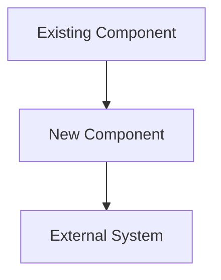
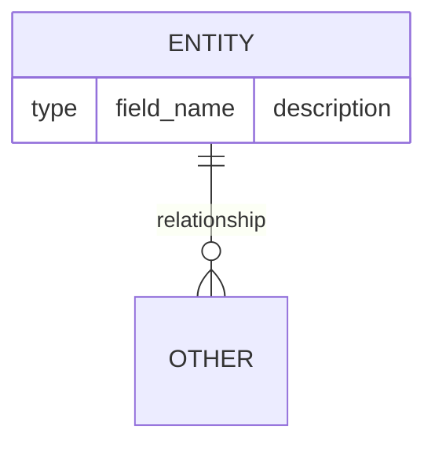

# FEAT-NNN: [Feature Title]

Status: draft
Date: YYYY-MM-DD
Author: [name]

## Progress

> Agent: update this section at each workflow step. Remove entire section when complete.

Current Step: [N]
Completed Steps: []
Last Updated: YYYY-MM-DD
Notes: [any state worth preserving across sessions]

---

## Context & Motivation

[Why is this feature needed? What problem does it solve? What triggered the request?]

## Goals

- [ ] [Goal 1 — specific and measurable]
- [ ] [Goal 2]

## Non-Goals

- [What this feature explicitly does NOT do — prevents scope creep]

## Architecture

[Describe the high-level design. How does this feature fit into the existing system?]

## Data Model

[Describe new or changed data structures, entities, or schemas.]

## API Surface / Interface

[Public interfaces, endpoints, methods, or events exposed or consumed by this feature.]

| Interface | Method/Type | Description |
|---|---|---|
| `endpoint or method` | GET / POST / fn | [what it does] |

## Edge Cases & Error Handling

| Scenario | Expected Behavior |
|---|---|
| [edge case] | [how the system responds] |

## Acceptance Criteria

- [ ] [Criterion 1 — testable, specific]
- [ ] [Criterion 2]

## Implementation Notes

> Agent: fill this section during feature-impl if implementation differs from spec.

[Any deviations from the design discovered during implementation.]

## Related Docs

- [FEAT-NNN: related feature](../features/FEAT-NNN-title.md)
- [ADR-NNN: architectural decision](../arch/adr/ADR-NNN-title.md)
