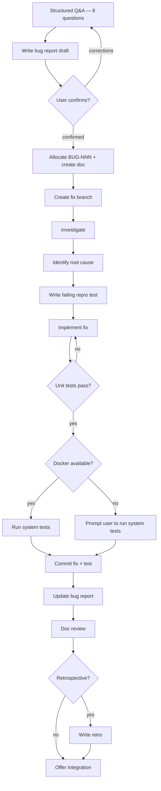

# Bug Fix Workflow



---

## Phase 1: Bug Intake

Ask these questions **one at a time**. Do not ask the next question until the current one is answered.

1. "Describe the bug briefly — what's going wrong?"
2. "What's your environment? (OS, language/runtime version, any relevant config)"
3. "Walk me through the exact steps to reproduce this."
4. "What did you expect to happen?"
5. "What actually happened? Please paste any error message, exception, or stack trace."
6. "Which component, module, or endpoint do you think is affected?"
7. "How severe is this?
   - **critical** — system is down or data is lost
   - **high** — major feature is broken
   - **medium** — degraded behavior, workaround exists
   - **low** — minor visual or non-critical issue"
8. "Is there a known workaround?"

After all answers, summarize back to the user:
> "Here's what I have — does this look correct? [show filled bug report fields]"

If corrections are needed: update and re-confirm. Proceed to Phase 2 only when confirmed.

---

## Phase 2: Autonomous Fix

### STEP 1: Allocate ID & Create Doc

> **✅ Gate — Bug Doc Exists**
> Complete STEP 1 fully. STEP 2 (branch creation) may proceed immediately after. Do NOT begin STEP 3 until the BUG-NNN doc exists in `docs/bugs/` and is registered in `docs/registry.md`.

1. Read `docs/registry.md`, find highest BUG-NNN, allocate next
2. Add to registry: `| BUG-NNN | BUG | [title] | in-progress |`
3. Copy `docs/templates/bug-report-template.md` to `docs/bugs/BUG-NNN-kebab-title.md`
4. Fill all fields from Phase 1 answers
5. Add `## Progress` section: `Phase: investigating | Hypothesis: — | Last Updated: [date]`

### STEP 2: Create Fix Branch

```bash
git checkout main    # or master
git pull
git checkout -b fix/BUG-NNN-kebab-title
```

### STEP 3: Investigate

Read all immediately relevant docs and source files:
- Source files for the affected component
- Relevant test files
- Related feature spec (if the behavior is documented in `docs/features/`)

If the context required becomes too large to handle in one session, note this in the retrospective for future workflow improvement.

**Coverage check** — before proposing a fix, identify whether a test for the affected failure path already exists. Note the finding in the bug report: "Existing coverage: [test name] / none". If no coverage exists, the reproduction test in STEP 4 will be the first.

Document root cause hypothesis in the `## Progress` section of the bug report:
```
Hypothesis: [your hypothesis about root cause]
```

### STEP 4: Write Failing Reproduction Test

Write a test that:
- Reproduces the exact bug as described (must FAIL before the fix)
- Will pass after the fix is applied
- Is the smallest test that captures the defect

Run it. **It must fail.** If it passes without a fix, revise the test.

### STEP 5: Implement Fix

Write the minimum change to address the root cause. Do not refactor surrounding code or fix unrelated issues in the same commit.

### STEP 6: Verify — Unit and Integration Tests

Run the full unit/integration test suite for the affected module(s). All tests must pass, including the new reproduction test.

If tests fail: fix the implementation, not the test (unless the test has a genuine error). Repeat until green.

### STEP 7: Verify — System Tests

System tests are **mandatory** when any of the following were changed:
- `docker-compose.full.yml`
- Any file under `system-test/`
- Kafka listener/producer wiring
- Saga state transitions

For all other changes, system tests are still strongly recommended.

Check whether Docker is running:
```bash
docker info > /dev/null 2>&1
```

- **If Docker is running:** run `./gradlew :system-test:test` and verify it passes.
- **If Docker is not running:** do not silently skip. Tell the user:
  > "System tests were not run locally because Docker is not available. Please either start Docker so I can run them, or run `./gradlew :system-test:test` yourself before merging."

### STEP 8: Commit

```
fix(BUG-NNN): [short description] — add reproduction test
```

### STEP 9: Update Bug Report

In `docs/bugs/BUG-NNN-*.md`:
- Fill `## Root Cause` with the actual root cause
- Fill `## Fix Summary` with what was changed and why
- Add test reference: file path and test name
- Remove `## Progress` section
- Update registry row status to `resolved`

Commit: `chore(BUG-NNN): finalize bug report`

### STEP 10: Doc Review

Read all immediately relevant docs:
- Does any feature spec describe behavior that this bug contradicts? If so, add a note to that spec.
- Should `docs/arch/architecture.md` note this as a known constraint or edge case?

Make only obvious, minimal improvements. Do not rewrite documentation.

### STEP 11: Retrospective

> **✅ Gate — Retrospective**
> Always offer the retrospective and wait for the user's answer before proceeding to STEP 12.

Ask: "Would you like to add a retrospective for this bug fix?"

If yes:
1. Allocate RETRO-NNN from registry
2. Copy `docs/templates/retrospective-template.md`
3. Write `docs/retrospectives/RETRO-NNN-bugfix-BUG-NNN.md`
4. Commit: `chore(RETRO-NNN): bug fix retrospective for BUG-NNN`

### STEP 12: Offer Integration

Ask the user:
> "The fix is complete on `fix/BUG-NNN-*`. How would you like to integrate it?
> - **A) Open a pull/merge request** — create a PR/MR for review
> - **B) Merge locally** — merge into main now
> - **C) Keep on branch** — continue work before integrating"

If **A**: generate PR title (`fix(BUG-NNN): [short description]`) and body summarizing:
- What the bug was (from report summary)
- Root cause
- Fix approach
- Test added

Confirm the PR description with the user before creating.
If **B**: confirm explicitly with the user before merging.
