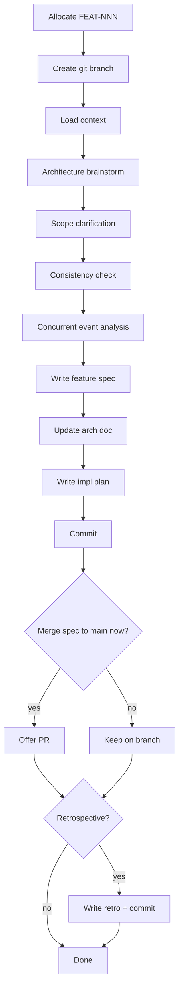

# Feature Specification Workflow



## Context Budget

Read these files at STEP 3 (max 5 total):
1. `docs/registry.md`
2. `docs/project-idea.md`
3. `docs/arch/architecture.md`
4. Related existing FEAT spec (if applicable)
5. Related existing FEAT spec (if applicable)

---

## Steps

### STEP 1: Allocate ID

1. Read `docs/registry.md`
2. Find the highest existing FEAT number; assign the next one (e.g., if FEAT-003 exists, allocate FEAT-004)
3. Add a row to the registry immediately: `| FEAT-NNN | FEAT | [title] | in-progress |`
4. Remember this as `FEAT_ID` for all subsequent steps

### STEP 2: Create Git Branch

```bash
git checkout main    # or master — check which is default
git pull
git checkout -b feat/FEAT_ID-kebab-title
```

Kebab-title = first 3–5 words of the feature name, lowercase, hyphens.

### STEP 3: Load Context

Read the files listed in the Context Budget above.
If the user mentioned this feature relates to an existing one, read that spec too.

### STEP 4: Architecture Brainstorm

Ask the user design questions **one at a time**. Explore:
- How does this feature fit into the current architecture?
- What new components, services, or modules are needed?
- What data changes are required (new entities, schema changes)?
- Are there integration points with external systems?
- Any performance, security, or scalability constraints?

**If the feature involves infrastructure (messaging, containers, databases), present infrastructure options *before* module/service design.**

If multiple approaches are viable, present 2–3 options with trade-offs. Agree on the approach before writing the spec.

**Never silently apply an established pattern** — when a design choice follows a prior feature, name the pattern and its origin: *"Following [pattern] from [FEAT-NNN], I'd use [X] here — does this look right?"* Always confirm before moving on.

### STEP 5: Scope Clarification

Continue Q&A to nail down (one question at a time):
- Exact goals and non-goals
- Edge cases and error scenarios
- Acceptance criteria — what does "done" look like?
- Dependencies on other features or external systems

Do not write the spec until scope is unambiguous.

### STEP 6: Consistency Check

Review the docs loaded in STEP 3:
- Does this feature conflict with any existing spec?
- Does this feature make any existing doc outdated?
- Flag conflicts to the user and note how to resolve them.

**ADR constraint check** — read `docs/arch/architecture.md` "Key Design Decisions" table. For each linked ADR:
- Is this feature's design consistent with the ADR's decision and constraints?
- If the feature touches the same area (e.g., state persistence, resilience patterns), the ADR's constraints are binding — note them in the spec explicitly so they are not re-litigated during implementation.

**Event field consistency check** — for every event introduced or modified by this feature:
- Verify the field list is identical in every section where it appears: Data Model, API Surface / Interface table, sequence diagrams, Publisher/Consumer tables.
- Mismatches are a blocker — resolve with the user before writing the spec.
- For features that introduce new message topics or queues: verify all new names follow the established naming pattern in the messaging topics table in `docs/arch/architecture.md`. Confirm names with the user before writing the spec.

Make any necessary updates to existing docs now (keep changes minimal).

### STEP 6b: Concurrent Event Analysis

**Apply this step whenever the feature touches a state machine** (saga steps, order status, entity lifecycle, or any component that guards duplicate/out-of-order events). Skip only if the feature has no stateful transitions.

For each stateful transition introduced or modified by this feature:

1. **List all events or actions that could arrive concurrently** — e.g., two copies of the same event, an older event arriving after a newer one, a user action racing an async event.
2. **For each concurrent scenario, name the guard** that prevents inconsistency — e.g., `isTerminalOrWarn()`, `applyTransition()` fromStatus check, idempotency key, database unique constraint.
3. **Present the analysis to the user as a table:**

| Transition | Concurrent scenario | Guard |
|---|---|---|
| `A → B` | Duplicate trigger event arrives twice | Idempotency guard drops the duplicate |
| `A → B` | Competing event arrives while first in-flight | State pre-condition check rejects invalid transition |

4. **Discuss any scenario that has no guard** — agree on whether it needs one or is acceptable to leave unguarded (and document the decision).

Do not proceed to STEP 7 until all concurrent scenarios are either guarded or explicitly accepted as out-of-scope.

### STEP 7: Write Feature Spec

1. Copy `docs/templates/feature-spec-template.md` to `docs/features/FEAT_ID-kebab-title.md`
2. Fill every section based on the Q&A from STEPs 4–6
3. Add a `## Progress` section at the very top of the new file:

```markdown
## Progress
Current Step: 7
Completed Steps: [1, 2, 3, 4, 5, 6]
Last Updated: [date]
```

### STEP 8: Update Architecture Doc

Open `docs/arch/architecture.md` and:
- Add new components to the Component Map (Mermaid graph)
- Update the Data Model if new entities or relationships are introduced
- Update External Dependencies if new third-party systems are involved

If this feature introduces a **significant architectural decision** (a choice that will constrain future work):
1. Allocate ADR-NNN from registry
2. Copy `docs/templates/adr-template.md` to `docs/arch/adr/ADR-NNN-kebab-title.md`
3. Fill the ADR with context, decision, and alternatives considered
4. Add a link in the architecture doc's "Key Design Decisions" section

### STEP 9: Write Implementation Plan

1. Allocate PLAN-NNN in registry (same number as FEAT-NNN: e.g., PLAN-001 for FEAT-001)
2. Copy `docs/templates/impl-plan-template.md` to `docs/plans/PLAN-NNN-kebab-title.md`
3. Break the feature into **vertical slices** — each slice delivers one testable piece of behavior
4. For each slice: name it, list files to touch, describe the test in plain language
5. Order slices from core domain logic outward (domain model → service → API → UI if applicable)

### STEP 10: Commit

Remove the `## Progress` section from `docs/features/FEAT_ID-*.md` — the spec is complete.

**Registry stub check** — before staging, scan `docs/registry.md` for any FEAT entries added during this session with status `draft`. For each one, verify a corresponding `docs/features/FEAT-NNN-*.md` file exists. If any is missing, create a stub now (title, status: draft, context & motivation, open design questions) before committing. A registry entry without a file is a dead link.

Stage all new and changed files:
```
feat(FEAT_ID): add feature spec, architecture update, and implementation plan
```

### STEP 11: Merge Decision

Ask the user:
> "The spec is ready on `feat/FEAT_ID-*`. Would you like to:
> - **A) Merge to main now** — spec reviewed before implementation starts (creates a PR for docs only)
> - **B) Keep on this branch** — implementation will continue here, one PR for everything"

If **A**: offer to create a PR for spec docs only. When implementation starts later, create a fresh `feat/FEAT_ID` branch from updated main.
If **B**: the branch is ready for the `feature-impl` workflow.

### STEP 12: Opt-in Retrospective

Ask: "Would you like to add a brief retrospective for this spec session?"

If yes:
1. Allocate RETRO-NNN from registry
2. Copy `docs/templates/retrospective-template.md` to `docs/retrospectives/RETRO-NNN-spec-FEAT_ID.md`
3. Ask 3 quick questions: what went well, what was difficult, improvement ideas
4. Fill the template and commit: `chore(RETRO-NNN): feature spec retrospective for FEAT_ID`
