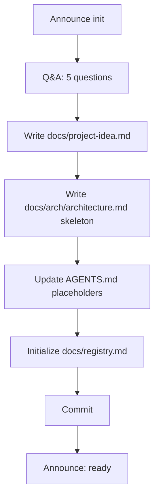

# Project Initialization Workflow



## Context Budget

Read only these files before starting (max 2):
1. `AGENTS.md`
2. `docs/registry.md` (if it exists — check silently)

---

## Steps

### STEP 1: Announce

Tell the user:
> "This project hasn't been initialized yet. I'll ask 5 quick questions to set it up — this takes about 5 minutes. Let's start."

### STEP 2: Q&A Session

Ask **one question at a time**. Wait for each answer before asking the next.

1. **Project name** — "What is the name of this project?"
2. **Purpose** — "In one sentence, what does this project do?"
3. **Tech stack** — "What language, framework, and build tool will you use? (e.g., Kotlin + Spring Boot + Gradle, TypeScript + Express + npm)"
4. **Core domain** — "What are the 3–5 main concepts or entities in this domain? (e.g., for an e-commerce app: Product, Order, Customer, Payment)"
5. **Starting point** — "Are you starting from scratch, or is there an existing codebase to build on?"

### STEP 3: Write `docs/project-idea.md`

Create the file:

```markdown
# [Project Name]

## Purpose
[One-line purpose from Q&A]

## Tech Stack
- Language: [answer]
- Framework: [answer]
- Build Tool: [answer]

## Core Domain
[For each concept/entity: name and one-sentence description]

## Starting Point
[Scratch / or description of existing codebase]

## Open Questions
[Any open questions or unknowns that surfaced during Q&A]
```

### STEP 4: Write `docs/arch/architecture.md`

Create the skeleton — sections with placeholder content only:

```markdown
# Architecture: [Project Name]

> Last updated: [date] | Version: 0.1

## System Overview
[Fill after first features are defined.]

## Tech Stack

| Layer | Technology | Reason |
|---|---|---|
| Language | [answer] | — |
| Framework | [answer] | — |
| Build | [answer] | — |

## Component Map

` ` `mermaid
graph TD
    A[TBD — fill during first feature spec]
` ` `

## Key Design Decisions

[Links to ADRs will appear here as features are specified.]

## Data Model Overview

` ` `mermaid
erDiagram
    TBD
` ` `

## API Surface
[Summary — details in feature specs.]

## External Dependencies
[Third-party services or libraries with non-obvious implications.]

## Non-Functional Requirements
- Performance: TBD
- Security: TBD
- Scalability: TBD
```

### STEP 5: Update `AGENTS.md`

Replace the three placeholder lines at the top of `AGENTS.md`:
- `[PROJECT_NAME]` → actual project name
- `[ONE_LINE_DESCRIPTION]` → actual one-line purpose
- `[TECH_STACK]` → actual tech stack summary

Also remove the "Project Initialization Template" section at the bottom of `AGENTS.md` (the brainstorming prompts block).

### STEP 6: Initialize `docs/registry.md`

Replace the empty table in `docs/registry.md` with the first entry:

```markdown
| FEAT-000 | FEAT | Project Init | complete |
```

Update the `Last updated` date.

### STEP 7: Commit

Stage and commit all created/modified files:
```
chore: initialize project from template
```

### STEP 8: Announce Completion

Tell the user:
> "Project initialized! Created:
> - `docs/project-idea.md` — your project north star
> - `docs/arch/architecture.md` — architecture skeleton (grows with features)
> - `docs/registry.md` — document ID registry
>
> **Next step:** Say **'spec feature [feature name]'** to define your first feature, or read `docs/USER-MANUAL.md` for a full overview."
