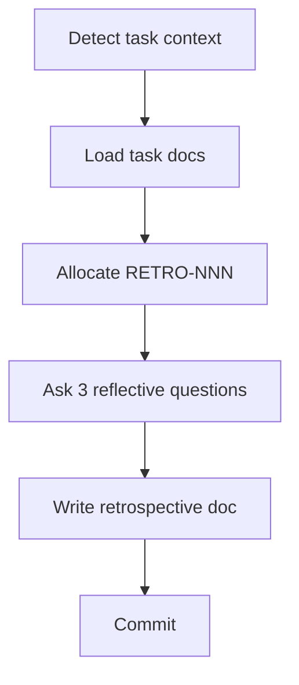

# Retrospective Workflow

> Trigger: "run retrospective"
> Use when: After completing any feature-spec, feature-impl, or bug-fix workflow — or any time you want to reflect on a recently completed task.
> Produces: `docs/retrospectives/RETRO-NNN-[type]-[related-id].md`



## Context Budget

Read at STEP 2 (after task context is identified):
- The identified spec, plan, or bug report for the current task

---

## Steps

### STEP 1: Detect Task Context

Read the current git branch name to identify the task:

```bash
git branch --show-current
```

- Branch `feat/FEAT-NNN-*` → task is FEAT-NNN; note workflow type as `feature-spec` or `feature-impl` (ask the user which if unclear)
- Branch `fix/BUG-NNN-*` → task is BUG-NNN; workflow type is `bug-fix`
- Any other branch → ask the user: "What task is this retrospective for? (e.g., FEAT-011 or BUG-006)"

### STEP 2: Load Task Context

Read the identified documents:
- For FEAT-NNN: read `docs/features/FEAT-NNN-*.md` and (if implementation is done) `docs/plans/PLAN-NNN-*.md`
- For BUG-NNN: read `docs/bugs/BUG-NNN-*.md`

This gives context for the reflective questions.

### STEP 3: Allocate RETRO-NNN

1. Read `docs/registry.md`, find the highest existing RETRO-NNN, allocate next
2. Add a row immediately: `| RETRO-NNN | RETRO | [workflow-type] retrospective for [FEAT/BUG-NNN] | complete |`

> **✅ Gate — ID Allocated**
> Write the registry row before writing the retrospective doc.

### STEP 4: Ask Reflective Questions

Ask these three questions **one at a time**. Wait for each answer:

1. "What went well in this [workflow-type] session?"
2. "What was difficult or caused friction?"
3. "What's one thing you'd improve about the workflow or process next time?"

### STEP 5: Write Retrospective Doc

1. Copy `docs/templates/retrospective-template.md` to:
   `docs/retrospectives/RETRO-NNN-[workflow-type]-[FEAT/BUG-NNN].md`
   (e.g., `RETRO-022-feature-impl-FEAT-011.md`)
2. Fill in:
   - Date: today
   - Workflow: feature-spec | feature-impl | bug-fix
   - Related: FEAT-NNN or BUG-NNN
   - What Went Well: from STEP 4 answer 1
   - What Was Difficult: from STEP 4 answer 2
   - Suggested Improvements: from STEP 4 answer 3 (max 3, each actionable)

### STEP 6: Commit

```bash
git add docs/registry.md docs/retrospectives/RETRO-NNN-*.md
git commit -m "chore(RETRO-NNN): [workflow-type] retrospective for [FEAT/BUG-NNN]"
```

---

## Completion Checklist

Use this to verify the workflow was followed completely before declaring done:

- [ ] Task context detected (FEAT-NNN or BUG-NNN identified, STEP 1)
- [ ] Task documents read for context (STEP 2)
- [ ] RETRO-NNN allocated and row added to `docs/registry.md` immediately (STEP 3)
- [ ] Three reflective questions asked and answered (STEP 4)
- [ ] `docs/retrospectives/RETRO-NNN-[type]-[related-id].md` written (STEP 5)
- [ ] Registry row status is `complete`
- [ ] Commit made with correct format (STEP 6)
